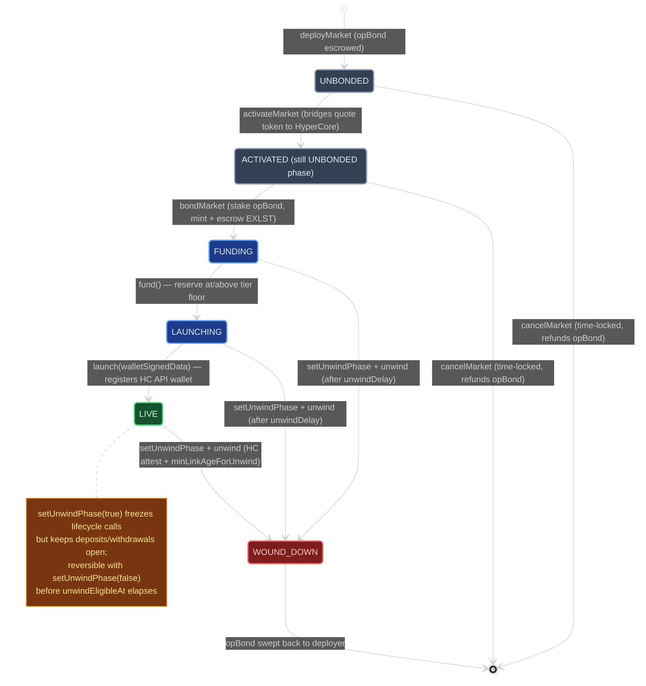
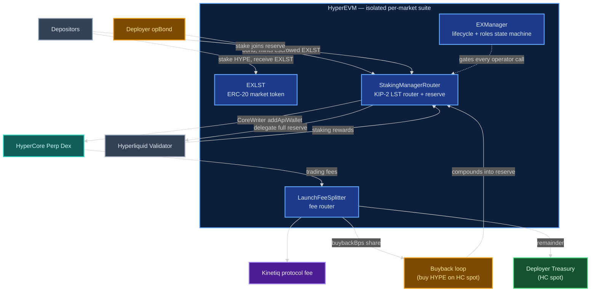
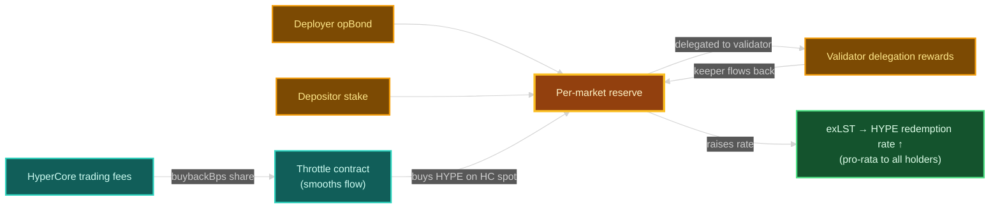
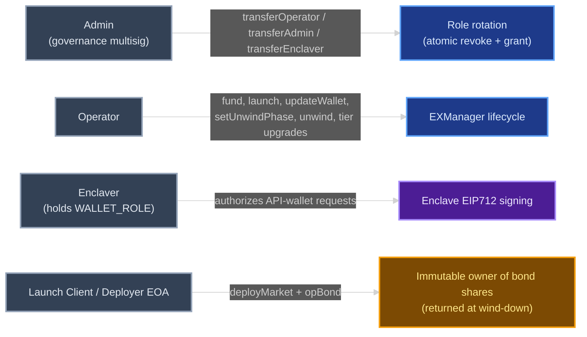
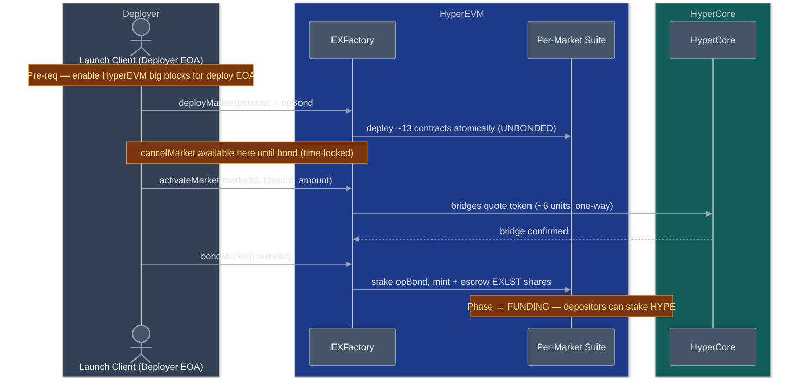
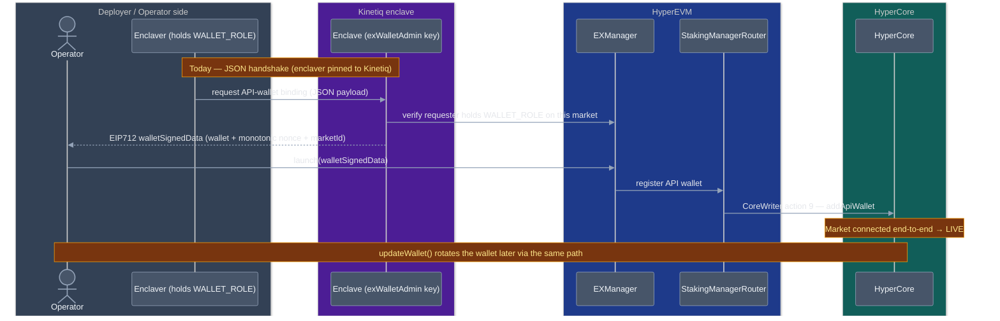
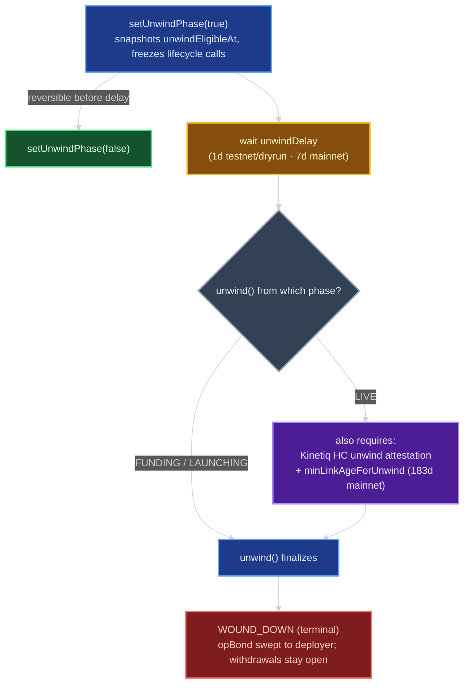
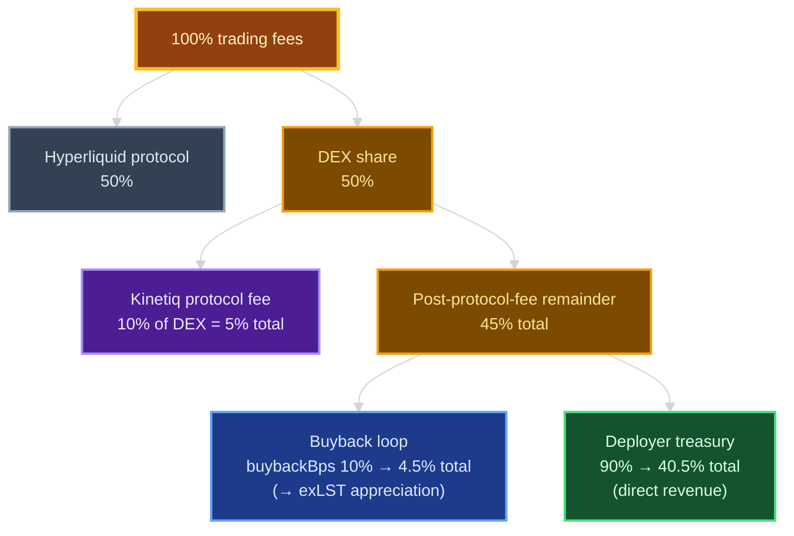
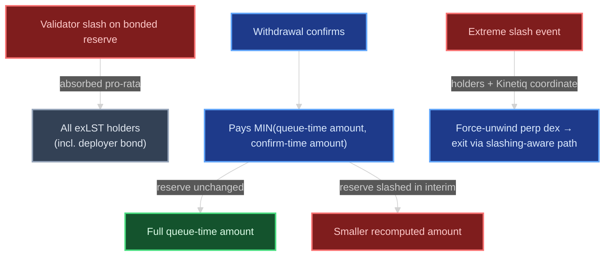

# Kinetiq Launch (HIP-3) — Deployer & Operator Guide

Kinetiq Launch is the Exchange-as-a-Service (EaaS) platform that lets a team deploy and run a HIP-3 perp dex on Hyperliquid in a few well-defined steps. This guide is for the **deployer** (the team that bonds capital and chooses the market's roles) and the **operator** (the address that runs day-to-day lifecycle calls). It covers what you deploy, what you configure, what gets called on-chain, and how the protocol coordinates with HyperCore behind the scenes.

What you end up owning when a Launch market is live: a per-market contract suite on HyperEVM, an ERC-20 exLST token unique to your market, a HyperCore perp dex paired with that suite, and a share of the trading fees that flow from it. The path from configuration to live trading is three on-chain calls plus a brief coordination with Kinetiq to register the market's HyperCore API wallet.

> **Diagram color key (consistent across every diagram below).** These diagrams use mermaid's **dark theme** and are tuned for a dark editor/preview background — every shape carries a solid fill so its label stays legible (no bare text floating on the canvas).
> 🟦 **Blue** — HyperEVM contracts / on-chain calls · 🟩 **Teal** — HyperCore side · 🟨 **Amber** — capital / reserve / value flow · 🟪 **Purple** — Kinetiq protocol / enclave · ⬜ **Slate** — external actors & roles · 🟢 **Green** — deployer revenue / exLST appreciation · 🟥 **Red** — risk / terminal state.

> **Diagram — Lifecycle at a glance (phase state machine).** The full path from deploy to wind-down, with the call that drives each transition.



## How a Launch market is structured

Each market deploys as an **isolated** per-market suite. Capital, exposure, and fee flow stay within the market — a loss or wind-down in one market does not affect another. The suite contains four contracts the deployer should know by name:

- **`EXManager`** — the lifecycle + roles state machine for the market. Holds the phase (UNBONDED → FUNDING → LAUNCHING → LIVE → WOUND_DOWN), gates every operator call, and tracks role membership.
- **`EXLST`** — the market's ERC-20 token. Depositors receive `EXLST` when they stake HYPE; the deployer's bonded `opBond` also mints `EXLST` at bond time. The token's redemption rate appreciates as the buyback loop converts trading fees into reserve HYPE.
- **`StakingManagerRouter`** — the per-market KIP-2 LST router. This is the contract that bonds your `opBond` plus depositor stake to your chosen validator on Hyperliquid, receives staking rewards from the validator delegation, and (after `launch`) holds the HyperCore API wallet registration that connects the market to the on-HC perp dex.
- **`LaunchFeeSplitter`** — the per-market fee router that takes trading fees on HyperCore and splits them between the protocol, the buyback loop, and your deployer treasury.

> **Diagram — Contract suite and value flow.** How the four named contracts wire to the validator, the HyperCore perp dex, and the fee splitter.



The exLST appreciates from **two independent sources**, both of which compound into the per-market reserve and raise the exLST → HYPE redemption rate over time:

- **Native validator delegation rewards.** The entire reserve — your bonded `opBond` plus all depositor stake — is delegated to your chosen Hyperliquid validator. Staking rewards accrue on that delegation continuously, and the keeper layer flows them back into the reserve.
- **HyperCore trading-fee buybacks.** A configurable share (`buybackBps`) of the per-market perp dex's trading fees converts to HYPE on HC spot and feeds back into the reserve via a per-market throttle contract that smooths the flow.

Both yield streams accrue to every exLST holder pro-rata, including the deployer's bonded position. There is no separate claim or vesting — the redemption rate simply moves up.

> **Diagram — Dual-yield appreciation loop.** Both streams compound into the same reserve and lift the redemption rate for every holder.



## Roles you choose at deploy

Three role addresses are chosen at deploy time. They can be the same address, distinct EOAs, multisigs, or any mix. Pick them with operational security in mind — they have different powers and different rotation paths.

- **Admin** — the meta-authority for your market. The admin's only on-chain power is rotating the operator, admin, and enclaver via `EXFactory.transferOperator` / `transferAdmin` / `transferEnclaver`. It does not run the lifecycle. This is typically your governance multisig.
- **Operator** — runs the market lifecycle on `EXManager`: `fund` (transition FUNDING → LAUNCHING), `launch` (LAUNCHING → LIVE), `updateWallet` (rotate the HC API wallet), `setUnwindPhase` and `unwind` (voluntary exit), plus tier upgrades in LIVE. Receives `OPERATOR_ROLE` on the per-market `EXManager`. Can be the same address as admin, or a dedicated operations key.
- **Enclaver** — the per-market on-chain identifier the Kinetiq signing enclave checks (via the market's `WALLET_ROLE`) when authenticating HyperCore-side API-wallet requests for your market. **Today**, while the initial deployer cohort onboards through a JSON handshake with Kinetiq, the enclaver is pinned to a Kinetiq-managed address. **Once Kinetiq exposes a deployer-facing API / UI for enclave interactions**, the enclaver becomes a deployer-chosen address: you set it to whichever wallet or service you want driving your market's wallet rotations, and the enclave authenticates incoming requests against your on-chain `WALLET_ROLE` membership. The on-chain mechanism is the same in both modes; what changes is the requester.

A fourth role, the **launch client / deployer EOA**, is whoever calls `EXFactory.deployMarket` and bonds the capital. That address becomes the immutable owner of the bond shares and receives them back when the market winds down.

> **Diagram — Roles and powers.** Who can call what, and what each role owns.



## Deployment configuration

Your market is described by the `MarketParams` struct that you pass to `EXFactory.deployMarket`. Most fields you fill in; a couple are pinned by Kinetiq for the initial cohort.

```solidity
struct MarketParams {
    address admin;
    address operator;
    address enclaver;
    uint256 opBond;
    address validator;
    address gate;
    string  lstName;
    string  lstSymbol;
    uint256 marketTier;
    address hyperCoreDeployer;
    address deployerTreasury;
    uint64  buybackBps;
}
```

### Fields you set

The roles you've already chosen — **admin** and **operator** — come first. You also pick:

- **`validator`** — the Hyperliquid L1 validator your market delegates to. Must be in Kinetiq's approved validator set; `deployMarket` reverts if it isn't.
- **`opBond`** — the deployer bond in wei. Must satisfy the network's `globalConfig.minOperatorBond()` floor (**1000 HYPE on mainnet**, 1 HYPE on testnet and mainnet-dryrun) and be 1e10-aligned, because HYPE bridges to HyperCore at 8 decimals and any sub-1e10 wei would be truncated. The bond is sent as `msg.value` on `deployMarket` (so the HYPE must sit on the deployer's **HyperEVM** balance at call time), locked for the life of the market, and returned to the deployer when wind-down finalizes.
- **`lstName` / `lstSymbol`** — the ERC-20 name and symbol for your per-market `EXLST` token. Visible to depositors in wallets and explorers.
- **`gate`** *(optional)* — an `IEXGate` contract address for access control on deposits and withdrawals. Set to `0x0` for no gate (the typical initial market setup). When set, the gate's `onDeposit` / `onWithdraw` hooks fire after every action and can revert to reject — useful for whitelisting, tiered caps, or token-lock-based mint allowances.
- **`hyperCoreDeployer`** — the HyperCore-side spot address that owns the HC ticker paired with your `EXLST`. This is the wallet that buys the ticker on the HC auction and deploys the HC spot asset.
- **`deployerTreasury`** — your treasury address on HyperCore spot (not HyperEVM). Receives your share of HIP-3 trading fees via the per-market `LaunchFeeSplitter`. Must already be **activated** on HyperCore — the factory's `deployMarket` checks this and reverts if not.
- **`buybackBps`** — the dial between exLST compounding and direct deployer revenue. Basis points (0–10000) of the post-protocol-fee remainder that route to the per-market buyback loop. Higher values send more value to exLST holders (including your bonded share); lower values send more to your `deployerTreasury` as direct revenue. Typical mainnet value is `1000` (10%).

### Fields pinned by Kinetiq

Two fields are pinned by Kinetiq today (not deployer-selectable):

- **`marketTier`** — the market tier index. Tier 1 is the HIP-3 default: a `minHypeStake` floor of 500,000 HYPE (the reserve floor enforced once the market is LIVE) and an `EXLST` supply cap of 750,000 HYPE-equivalent. Higher tiers unlock additional capacity and are gated by Kinetiq's tier registry.
- **`enclaver`** — for the initial deployer cohort, this is set to a Kinetiq-managed address while the JSON-handshake onboarding flow is in place. Once Kinetiq ships the deployer-facing API / UI for the enclave, deployers set this themselves to a wallet or service they control. The on-chain authentication mechanism (the `WALLET_ROLE` check inside the enclave) is unchanged either way.

## HyperCore configuration

The HyperCore side of the deploy is described in a small JSON payload the deployer hands to Kinetiq during onboarding. Two distinct concerns live in this JSON.

**Asset registration.** The JSON specifies the perp's coin ticker, size decimals, initial oracle price, margin table id, isolated-versus-cross flag, dex namespace, full dex name, and the collateral token id (the asset traders post on the perp; the same token id is what `activateMarket` bridges). Kinetiq submits the `perpDeploy.registerAsset` and accompanying setup variants on the deployer's behalf during onboarding to bring the per-market perp dex online for the first time.

**Sub deployers.** The JSON also lists the deployer's own addresses that should be authorized to call specific HC `perpDeploy` variants on an ongoing basis. These are addresses the **deployer controls** — Kinetiq does not custody them. After onboarding, the deployer uses these sub deployer addresses to directly call HC variants: adding new coin tickers to the dex via `registerAsset`, updating oracle prices via `setOracle`, adjusting funding multipliers, halting trading, and so on. No further JSON handshake with the protocol team is required for these ongoing HC operations.

## The deployment sequence

The on-chain path from configuration to a FUNDING-phase market is three calls on `EXFactory`. HyperCore must confirm the activation token bridge between phases 2 and 3, so each is its own transaction.

> **Before you deploy: enable HyperEVM big blocks for your deployer address.** The per-market suite is roughly thirteen contracts deployed atomically by `EXFactory.deployMarket`, and it will not fit in HyperEVM's default block gas limit. Big blocks must be toggled on for the deploy EOA *before* you call `deployMarket`, or the transaction will revert.

```solidity
EXFactory.deployMarket{value: opBond}(params);          // 1. escrow opBond, deploy per-market suite
EXFactory.activateMarket(marketId, tokenId, amount);    // 2. bridge activation token to HyperCore
EXFactory.bondMarket(marketId);                         // 3. finalize bond -> FUNDING
```

> **Diagram — Deployment sequence.** The three `EXFactory` calls and the one-way HyperCore bridge that must confirm between phases 2 and 3. Participant boxes are tinted by domain (slate = deployer, blue = HyperEVM, teal = HyperCore).



1. **`deployMarket`** — the launch client submits the `MarketParams` struct plus `opBond` HYPE to `EXFactory`. The factory escrows the bond, deploys the full per-market contract suite, and stores `MarketInfo`. *Capital here*: `opBond` HYPE on the deployer EOA **on HyperEVM** (≥ 1000 HYPE on mainnet). If your HYPE balance lives on HyperCore spot, bridge it over to HyperEVM before calling. (Requires big blocks enabled — see callout above.)

2. **`activateMarket`** — anyone can call this, though typically the launch client does. The factory pulls the activation token from the caller's **HyperEVM** balance (default: USDC; the protocol requires roughly 6 USDC for the three CoreWriter-calling contracts to each receive an HC account) and bridges per-contract shares to HyperCore. *Capital here*: the activation token must be on HyperEVM at call time — bridge from HyperCore spot first if your balance lives there. HyperCore must confirm the bridge before bonding can proceed.

3. **`bondMarket`** — the launch client closes the loop. No additional capital is required for this call. The factory forwards the already-escrowed `opBond` to be staked in the protocol, where it earns validator delegation rewards alongside depositor stake. The `EXLST` shares minted 1:1 against the bonded stake are escrowed in `EXManager` as the deployer's **skin in the game** — locked for the life of the market and swept back to the deployer only when wind-down finalizes. The market transitions to **FUNDING**, and depositors can now stake HYPE through the protocol's deposit flow.

### Pre-bond exit — `cancelMarket`

Between `deployMarket` and `bondMarket`, the launch client may abort the deploy via `EXFactory.cancelMarket(marketId, recipient)`. The factory refunds the escrowed `opBond` to the chosen recipient (defaults to the deploy EOA if omitted). The call is **time-locked**: it becomes available only after `block.timestamp >= cancelEligibleAt`, where `cancelEligibleAt` was snapshotted at `deployMarket` time as `block.timestamp + globalConfig.unwindDelay()`. That delay is 1 day on testnet and mainnet-dryrun, and 7 days on mainnet.

One caveat: if the activation token was already bridged to HyperCore via `activateMarket`, it is not recoverable on L1 — bridge transfers are one-way. `cancelMarket` is the right path for a deployer who decides not to launch before bonding — for example a risk-parameter rethink or any other reason to step back. After bonding, the exit path moves to the operator-driven `setUnwindPhase` → `unwind` flow described below.

## What happens after bond — operator lifecycle

Once `bondMarket` lands and the market is in FUNDING, the operator takes over for the rest of the lifecycle. The admin's role is reactive (rotate keys if needed). Three flows matter to the operator: going LIVE, ongoing operations, and voluntary wind-down.

### Funding to launch

Two operator calls bracket the transition from FUNDING through LAUNCHING into LIVE.

```solidity
EXManager.fund();                          // 1. FUNDING -> LAUNCHING (reserves >= tier floor)
EXManager.launch(walletSignedData);        // 2. LAUNCHING -> LIVE (registers HC API wallet)
```

The operator calls `fund()` once the per-market reserve meets the tier floor (500,000 HYPE for Tier 1). It's callable any time reserves are at or above the floor, so the operator can choose to wait until reserves reach the tier's `EXLST` supply cap (750,000 HYPE for Tier 1) before going LIVE if they want to mint more shares first. This is a pure HyperEVM state transition — no HyperCore interaction yet.

For `launch`, the contract requires an EIP712-signed `walletSignedData` payload. The payload carries the **HyperCore API wallet** — the "agent" address that signs HyperCore actions on behalf of the market's `StakingManagerRouter` — plus a monotonic nonce and the target market id. The enclave signs this payload with `globalConfig.exWalletAdmin`. Once `EXManager.launch(walletSignedData)` runs, the `StakingManagerRouter` calls CoreWriter action 9 (`addApiWallet`) to register the API wallet on HyperCore. The market is now connected end to end and trading can proceed.

> **Diagram — `launch` / API-wallet signing flow.** How the enclave authenticates the request (via `WALLET_ROLE`) and signs the payload that `launch` submits on-chain. `updateWallet` later rotates the wallet through the same path. Boxes: slate = deployer/operator, purple = Kinetiq enclave, blue = HyperEVM, teal = HyperCore.



The signing key (`globalConfig.exWalletAdmin`) is held in an enclave so it never leaves the protocol's trusted execution boundary. Before signing, the enclave checks that the request comes from an authorized requester — specifically, that the requester holds `WALLET_ROLE` on the target market's `EXManager`. That role is held by the per-market **enclaver** address chosen at deploy.

**For the initial deployer cohort**, the enclaver is pinned to a Kinetiq-managed address and the request flow is a simple JSON handshake: the deployer submits a small JSON payload describing the API wallet they want bound to the market, the enclave returns the EIP712-signed `walletSignedData`, and the operator submits it on-chain. Subsequent rotations via `updateWallet` follow the same path.

**Once Kinetiq exposes a deployer-facing API / UI for enclave interactions**, the picture shifts: deployers set the enclaver to a wallet or service they control, and make wallet-payload requests directly through that interface. The enclave still performs the same on-chain `WALLET_ROLE` authentication and the same EIP712 signing — only the requester changes from "Kinetiq protocol team via JSON exchange" to "deployer's own enclaver-bound client." The on-chain verification (signature, market binding, monotonic nonce) is identical in both modes; the JSON handshake today is an onboarding-velocity choice rather than a trust mode the protocol depends on.

### Ongoing operations

While the market is LIVE, the operator's recurring on-chain surface is small. The main call is `updateWallet(walletSignedData)` — rotating the HyperCore API wallet at any time using the same Kinetiq-signed payload path as `launch` (allowed in LIVE and WOUND_DOWN). Gas top-ups for HyperCore HIP-3 auctions are paid by the deployer's sub deployer addresses on the HyperCore side rather than from EVM, so no operator EVM call is needed for that.

The admin can rotate the operator, admin, or enclaver at any time via `EXFactory.transferOperator` / `transferAdmin` / `transferEnclaver`. Each is an atomic revoke-and-grant on `EXManager`; the previous holder loses the role in the same transaction.

Tier upgrades to higher reserve floors flow through a queue-then-confirm pattern, time-locked by `globalConfig.tierUpgradeDelay`. These are enabled by Kinetiq when higher tiers are introduced.

### Voluntary unwind

The operator initiates a wind-down with `setUnwindPhase(true)`. This snapshots `unwindEligibleAt = block.timestamp + globalConfig.unwindDelay()` and immediately freezes the operator's lifecycle calls (`fund`, `launch`, tier flow, operator-relay `updateWallet`). Deposits and withdrawals stay open so depositors can exit. The operator can reverse course with `setUnwindPhase(false)` before `unwindEligibleAt` elapses.

After the delay (1 day on testnet/mainnet-dryrun, 7 days on mainnet), the operator calls `unwind()` to finalize. The `opBond` shares sweep back to the deployer and the market enters WOUND_DOWN, a terminal phase where withdrawals and confirms remain available for exit liquidity.

One important caveat for LIVE-phase unwinds. From FUNDING or LAUNCHING, `unwind()` finalizes after `unwindDelay` alone. From LIVE, it additionally requires Kinetiq's HC-side attestation that the on-HC perp dex has begun unwinding, **and** the elapsed time since the market's HyperCore link (when Kinetiq attested the perp deploy was live) must satisfy `minLinkAgeForUnwind`. That cliff is 1 day on testnet/mainnet-dryrun and **183 days on mainnet**. Operators planning a mainnet wind-down should account for it.

> **Diagram — Voluntary unwind, two finality paths.** Pre-LIVE phases finalize on `unwindDelay` alone; a LIVE-phase unwind adds the HC attestation and the `minLinkAgeForUnwind` cliff (red).



## Fees and the deployer treasury

HIP-3 trading fees on the per-market HC perp dex flow through a three-way split. Hyperliquid takes 50% directly at the protocol level; the remaining 50% is the DEX share. Kinetiq takes a protocol fee from the DEX share (initially 10% — so 5% of total trading fees). The post-protocol-fee remainder then splits between the per-market buyback loop and the deployer's direct revenue, with `buybackBps` as the dial:

- **Buyback share** (`buybackBps` of the remainder) routes to the per-market buyback wallet, which buys HYPE on HC spot and compounds it back into the market reserve via a per-market throttle contract that smooths the flow. Higher buyback means more exLST appreciation, including for your own bonded position.
- **Deployer share** (the rest) routes to your `deployerTreasury` on HyperCore spot as direct, immediately-claimable revenue.

A worked example at the typical `buybackBps = 1000` (10%): from 100% of trading fees, Hyperliquid receives 50, Kinetiq's protocol fee takes 5, the buyback loop receives 4.5, and the deployer treasury receives 40.5. Tuning `buybackBps` upward shifts more of that 45% post-protocol-fee remainder toward the buyback loop; tuning it down shifts more to direct treasury revenue.

> **Diagram — Fee split (worked example at `buybackBps = 1000`).** Percentages shown as share of total trading fees.



## Slashing risk

The per-market reserve — your bonded `opBond` plus every depositor's stake — is delegated to your chosen Hyperliquid validator and exposed to Hyperliquid's HIP-3 deployer slashing mechanism. The risk is real and structural; deployers should communicate it clearly to depositors when promoting the market.

### HIP-3 deployer slashing

Slashing triggers, thresholds, and the validator-vote process are specified in the [HIP-3 slashing documentation](https://hyperliquid.gitbook.io/hyperliquid-docs/hyperliquid-improvement-proposals-hips/hip-3-builder-deployed-perpetuals#slashing). Hyperliquid notes that the expected mainnet outcome is that slashing never triggers, but the protocol-level mechanism is real and applies for the full life of the bonded delegation, including the unstaking queue period.

### Pro-rata impact on exLST holders

Within the Kinetiq Launch HyperEVM structure, a slash on the bonded reserve is absorbed **pro-rata across all exLST holders**, including the deployer's own bonded position. There is no separate deployer protection — alignment between deployer and depositors is structural. The protocol's confirm step is slashing-aware: when a withdrawal confirms, it pays out the smaller of the queue-time HYPE amount and the recomputed amount at confirm time. Withdrawals never receive more than was earned, but they can receive less if the reserve was slashed in the interim.

> **Diagram — Slashing-aware exit.** A slash is absorbed pro-rata, and the confirm step pays the smaller of queue-time and confirm-time amounts.



### Force unwind in extreme events

In the event of an extreme slashing event, **exLST holders in coordination with Kinetiq can force-unwind the perp dex**, allowing remaining capital to exit through the slashing-aware withdrawal path. This is an emergency escape hatch, not the normal voluntary-unwind flow — the operator-driven `setUnwindPhase` → `unwind` path described above remains the primary wind-down mechanism for non-emergency exits.

## Pre-flight rehearsal

Before committing real capital, Kinetiq provides a fork-based rehearsal tool that exercises the full lifecycle end to end — deploy, activate, bond, deposit, withdraw, reward distribution, and the confirm flow — against a live network fork without any on-chain effect. Deployers run this with their planned deploy address as the simulated sender; the rehearsal reads the address's live balance on the fork and logs whether it would have had enough HYPE and activation token for a real deploy, then continues via test-environment top-ups so the full sequence runs regardless.

Running the rehearsal before a mainnet deploy is strongly recommended. Mainnet's 1000 HYPE bond floor is non-trivial, the per-market suite requires HyperEVM big blocks to be pre-enabled, and the activation token bridge is one-way. A successful rehearsal confirms all of the above will work for your address before you spend gas on the real path.

## Onboarding and support

Kinetiq operates the enclave, the initial HyperCore `perpDeploy` submissions, and ongoing keeper services (reward distribution, withdrawal queue processing) for every Launch market. The deployer and operator stay in control of role transfers, lifecycle decisions, treasury, and the day-to-day HyperCore operations through their authorized sub deployer addresses.

The initial `registerAsset` for a new market is handled by Kinetiq during onboarding; subsequent tickers on the same dex are deployer-driven through the sub deployer addresses you control.

To begin onboarding, contact the Kinetiq team at `contact@kinetiq.xyz` with the rough shape of your market — collateral token, intended tier, validator preference, and any custom sub deployer needs. The team responds with the deployer config JSON template and walks through the deploy sequence on testnet first, then mainnet-dryrun, then production mainnet.
