# Kinetiq Launch Protocol

> **Permissionless HIP-3 Perp DEX Launcher on Hyperliquid EVM.**
> *Anyone deploys an HIP-3 perp market in one transaction. Kinetiq runs the infrastructure. Operators bring liquidity and tickers.*

| Field | Value |
|---|---|
| **License** | BUSL-1.1 (most contracts); MIT (interfaces, libraries, helpers — see SPDX headers) |
| **Solidity** | 0.8.34 (pinned), `evm_version = cancun` (HyperEVM target) |

---

## Table of Contents

- [Overview](#overview)
  - [Vision](#vision-the-shopify-of-hip-3-perps)
  - [Key Features](#key-features)
- [System Architecture](#system-architecture)
  - [Component Overview](#component-overview)
- [Actors & Roles](#actors--roles)
  - [Market-Level Authority](#market-level-authority)
  - [GlobalConfig (deployer/operator/depositor-facing fields)](#globalconfig-deployeroperatordepositor-facing-fields)
  - [Participants](#participants)
  - [Enclaver / WALLET_ROLE](#enclaver--wallet_role)
- [Market Lifecycle Phases](#market-lifecycle-phases)
  - [UNBONDED](#unbonded)
  - [FUNDING](#funding)
  - [LAUNCHING](#launching)
  - [LIVE](#live)
  - [WOUND_DOWN](#wound_down)
- [Key Flows](#key-flows)
  - [Market Deployment Flow](#market-deployment-flow)
  - [Deposit Flow](#deposit-flow)
  - [Withdrawal Flow](#withdrawal-flow)
  - [Withdrawal Decision Tree](#withdrawal-decision-tree)
  - [Confirm Withdrawal Flow](#confirm-withdrawal-flow)
  - [BlockedWithdrawalQueue Processing](#blockedwithdrawalqueue-processing)
  - [Wallet Admin Flow](#wallet-admin-flow)
  - [HC Attester Callbacks (link / release)](#hc-attester-callbacks-link--release)
  - [Tier Upgrade Flow](#tier-upgrade-flow)
  - [Fee Distribution Flow](#fee-distribution-flow)
  - [Unwind Flow](#unwind-flow)
- [Gate System](#gate-system)
- [Market Tier System](#market-tier-system)
- [Slashing-Aware Withdrawals](#slashing-aware-withdrawals)
- [Contract Documentation](#contract-documentation)
  - [GlobalConfig](#globalconfig)
  - [EXFactory](#exfactory)
  - [EXManager](#exmanager)
  - [EXLST](#exlst)
  - [EXRouter](#exrouter)
  - [BlockedWithdrawalQueue](#blockedwithdrawalqueue)
  - [Gate Contracts](#gate-contracts)
- [Token Mechanics & Accounting](#token-mechanics--accounting)
  - [Reserve Asset Model](#reserve-asset-model)
  - [Share-Math Primitives](#share-math-primitives)
  - [Fee Model](#fee-model)
  - [Decimal Alignment](#decimal-alignment)
- [Invariants & Security](#invariants--security)
  - [Critical Invariants](#critical-invariants)
  - [Security Mechanisms](#security-mechanisms)
- [Integration Guides](#integration-guides)
  - [User Integration](#user-integration)
  - [Operator Guide](#operator-guide)
- [Technical Details](#technical-details)

---

## Overview

Kinetiq Launch is a Solidity protocol on Hyperliquid EVM for **launching and managing HIP-3 perpetual futures markets**. Anyone can deploy a fully-isolated, fully-staffed market in a single transaction by calling `EXFactory.deployMarket{value: opBond}(MarketParams)`. The factory provisions the per-market contract suite and registers the market under a `(deployer, nonce)` identity.

Each deployed market runs on its own isolated liquid staking layer so it has an isolated L1 staking identity, isolated risk surface, and isolated accounting. Kinetiq manages the protocol-side infrastructure (oracle reporting, L1 ops, fee distribution, upgrades) so deployers and operators only need to focus on ticker selection, liquidity, and market promotion.

### Vision: The Shopify of HIP-3 Perps

**Design Principle:** *"One click and it just works out of the box."*

| Kinetiq Handles (Default) | Operator Handles |
|---------------------------|------------------|
| API wallet infrastructure (TEE/enclave) | Ticker selection |
| Oracle reporting & L1 operations bots | Liquidity provision |
| Validator delegation (operator picks from approved set) | Market promotion |
| LST infrastructure (staking, withdrawals, accountant) | Bond posting |
| Smart contract deployment + upgrades | Gate selection |

- **For Operators:** Zero infrastructure burden by default. Deploy → activate → bond → fund → launch. No bots to run, no wallets to manage.
- **For Kinetiq:** Revenue scales with trading volume across every deployed market — `protocolFeeShare` of the operator's HIP-3 fee share routes to KNTQ buybacks.
- **For Hyperliquid:** Proliferation of HIP-3 exchanges drives ecosystem growth.

### Key Features

- **Permissionless factory deployment.** `EXFactory.deployMarket(MarketParams)` deploys the full per-market suite in one tx. Three-phase deploy: `deployMarket` (escrows opBond) → `activateMarket` (bridges activation token to L1 spot for the market's CoreWriter-calling contracts) → `bondMarket` (forwards bond, market enters FUNDING). Pre-bond `cancelMarket` time-lock provides a deployer exit if activation stalls.
- **HYPE-only funding.** FUNDING accepts HYPE only and stakes it to the per-market reserve → exLST is mintable from day one. LAUNCHING is a single wallet-sig handoff.
- **Gate system.** `IEXGate` post-core hooks (revert to reject). Standard gates: `NoOp`, `MultiplexerGate` (phase routing), `WhitelistGate` (EIP712 sigs + tier caps), `TieredMintGate` (sKNTQ-locked allowance), `CompositeGate` (AND-composition). Operators pick or compose at deploy.
- **Market tier system.** 1-indexed tier registry on `GlobalConfig` (`MarketTier{minHypeStake, supplyCap, name}`). Per-market `marketTier` cached on EXManager. Three-step strict-increase upgrade flow.
- **Slashing-aware withdrawals.** Withdrawal confirms pay `min(stored, recomputed)` at confirm time, so a queued user cannot exit at a stale pre-slashing rate; BWQ confirms apply the same pro-rata adjustment per batch.
- **Fee model.** HIP-3 fees split 50/50 with Hyperliquid; Kinetiq takes `protocolFeeShare` (initial 10%) of the operator's 50% share. The deployer's remaining share is split between direct treasury revenue and a buyback loop that compounds the exLST rate; the split is set per-market via `MarketParams.buybackBps`.

---

## System Architecture

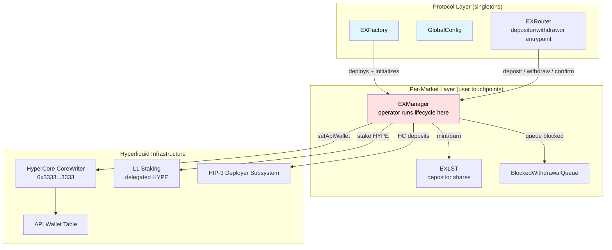

> Each market also runs a Kinetiq-managed LST + fee distribution stack (staking router, accountant, validator manager, oracle, reward tracker, fee splitter, throttle) that connects EXManager to L1 staking and routes HIP-3 trading fees. These contracts are not directly called by deployers, operators, or depositors and are documented in the protocol repository.

### Component Overview

**Protocol-level singletons (deployer/operator/depositor touchpoints):**

| Contract | Purpose | Key Responsibilities |
|---|---|---|
| `EXFactory` | Deploys per-market suites; market registry | 3-phase deploy (`deployMarket`/`activateMarket`/`bondMarket`); pre-bond `cancelMarket` time-lock; `transferOperator`/`transferAdmin`/`transferEnclaver`; market lookups (`getMarket`/`getMarketContracts`/`isMarket`/`marketId`) |
| `GlobalConfig` | Cross-market parameters + tier registry + activation token registry | `unstakeFeeRate`, `unwindDelay`, `minOperatorBond`, `minimumWithdrawWhenLive`, `tierCount`, `tierUpgradeDelay`, `marketTiers(tier)`, `activationTokens(tokenId)` |
| `EXRouter` | Stateless depositor/withdrawor entrypoint | `deposit`/`withdraw`/`confirm`/`confirmBlockedWithdrawal`/`confirmAll`; slashing-adjusted view helpers |

**Per-market contracts (user touchpoints):**

| Contract | Purpose | Key Responsibilities |
|---|---|---|
| `EXManager` | Market state machine | Lifecycle (`activate`/`bond`/`fund`/`launch`/`setUnwindPhase`/`unwind`), deposits/withdrawals/confirms, gate hook invocation, tier upgrade flow, wallet rotation |
| `EXLST` | Market share token (held by depositors) | ERC20 + ERC20Permit + ERC20Votes; supplyCap (per tier) |
| `BlockedWithdrawalQueue` | LIVE-phase reserve protector | FIFO queue for withdrawals that exceed the LIVE reserve floor; permissionless processing |

> Each market also runs a Kinetiq-managed LST infrastructure stack (staking router, accountant, validator manager, oracle, reward tracker, fee splitter, throttle). These are not directly called by deployers, operators, or depositors; they are documented in the protocol repository.

---

## Actors & Roles

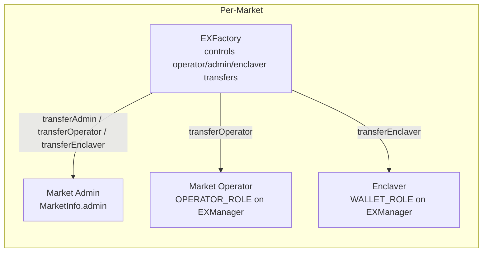

> Kinetiq retains a separate stack of protocol-side roles (admin, manager, operator, treasury, recovery) for upgrades, oracle reporting, L1 ops, fee splitting, and recovery. These roles are exercised by Kinetiq through the `ProtocolRolesController` singleton and do not directly affect deployer / operator / depositor flows.

### Market-Level Authority

| Role | Held by | Capability |
|---|---|---|
| `EXManager.OPERATOR_ROLE` | Market operator (deployer-chosen via `MarketParams.operator`) | Lifecycle (`fund`, `launch`, `setUnwindPhase`, `unwind`), `addOperatorAuctionGas`, `stakeFees`, tier flow (`queueTierUpgrade` / `raiseSupplyCapForUpgrade` / `confirmTierUpgrade` / `cancelTierUpgrade`), wallet relay (`updateWallet`) |
| `EXManager.WALLET_ROLE` | Deployer-specified `enclaver` (`MarketParams.enclaver`; rotatable via `EXFactory.transferEnclaver` by `MarketInfo.admin`) | **Passive identifier** — does not gate any on-chain logic. The off-chain enclave authenticates HyperCore-side HIP-3 API-wallet requests for this market against `hasRole(WALLET_ROLE, requester)`. See [Enclaver / WALLET_ROLE](#enclaver--wallet_role) below. |
| `MarketInfo.admin` (factory state, not an EXManager role) | Operator-chosen at deploy | `EXFactory.transferOperator(marketId, newOperator)`, `transferAdmin(marketId, newAdmin)`, `transferEnclaver(marketId, newEnclaver)` |
| `MarketInfo.deployer` (factory state, immutable) | `msg.sender` at `deployMarket` | Owns the bond capital; receives excess shares at `bond` and bond return at `unwind`; calls `bondMarket` and `cancelMarket` |

### GlobalConfig (deployer/operator/depositor-facing fields)

| Field | Why it matters |
|---|---|
| `unstakeFeeRate` (BPS) | Withdrawal fee applied at confirm time (max 10%) |
| `minOperatorBond` (HYPE) | Floor for `MarketParams.opBond` (`Constants.MIN_OPERATOR_BOND = 100 HYPE`; mainnet config initially `1000 HYPE`) |
| `unwindDelay` (seconds) | Delay between queue and finalize on `setUnwindPhase` / `cancelMarket` (`MIN = 1 day`, `MAX = 90 days`) |
| `tierUpgradeDelay` (seconds) | Delay on `queueTierUpgrade` (`MIN = 1 day`) |
| `minimumWithdrawWhenLive` (exLST) | Per-protocol LIVE-phase withdrawal floor (max 100 ether) |
| `marketTiers(tier)` | Per-tier `minHypeStake` + `supplyCap` + name; cached on EXManager at deploy |
| `activationTokens(tokenId)` | HIP-1 activation token metadata (ERC20 + decimals + adapter + destinationDex); read by deployers to approve + activate |

`CONFIG_ADMIN_ROLE` mutates these via setters; held by Kinetiq.

### Participants

- **Market deployer** — calls `EXFactory.deployMarket{value: opBond}(MarketParams)`, becomes `MarketInfo.deployer` (immutable owner of bond capital).
- **Market admin** — `MarketInfo.admin`; controls operator/admin/enclaver role transfers via `EXFactory.transferOperator` / `transferAdmin` / `transferEnclaver`.
- **Market operator** — `OPERATOR_ROLE` on EXManager; runs the lifecycle.
- **Market enclaver** — `WALLET_ROLE` on EXManager; authenticator for HyperCore-side HIP-3 API-wallet requests (see [Enclaver / WALLET_ROLE](#enclaver--wallet_role)).
- **Depositors** — anyone who calls `EXRouter.deposit(market, recipient, data)`.
- **Whitelister** — per-gate signer, set by gate `MANAGER_ROLE`.
- **sKNTQ holders** — TieredMintGate-gated markets; lock sKNTQ for mint allowance.

### Enclaver / WALLET_ROLE

The `enclaver` is a per-market, deployer-chosen address that holds `WALLET_ROLE` on the market's EXManager. It does **not** gate any on-chain logic — it's a passive identifier the off-chain enclave reads via `hasRole(WALLET_ROLE, requester)` to authenticate incoming HyperCore-side HIP-3 API-wallet requests for that specific market.

- **Set at deploy:** `MarketParams.enclaver` passes through `EXFactory.deployMarket` → `EXManager.initialize` → `_grantRole(WALLET_ROLE, params.enclaver)`. Reverts `InvalidMarketParams` on zero address.
- **Rotatable:** `EXFactory.transferEnclaver(marketId, newEnclaver)` — admin-only. Atomically revokes WALLET_ROLE from the old holder, grants to the new, updates `MarketInfo.enclaver`, emits `EnclaverTransferred`.
- **Query:** `EXManager.enclaver()` returns the first member of `WALLET_ROLE` (single-holder convention).
- **Submitter implementation is the deployer's choice** — enclave-backed wallet, MPC, hot key, multisig.

---

## Market Lifecycle Phases

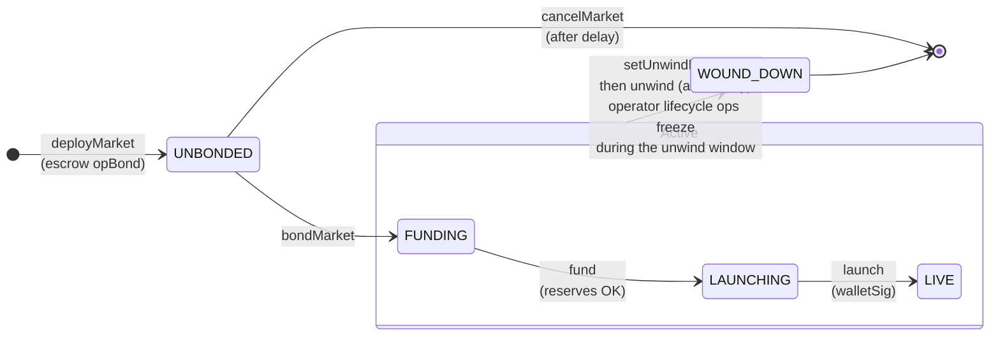

> `activateMarket` is a UNBONDED-state action that completes L1 prerequisites; it does not transition the phase.

### UNBONDED

Initial state after `deployMarket`. The factory has escrowed `params.opBond` HYPE and snapshotted `cancelEligibleAt = block.timestamp + globalConfig.unwindDelay()`.

| Allowed | Function | Caller | Notes |
|---|---|---|---|
| ✓ | `EXFactory.activateMarket(marketId, tokenId, amount)` | Anyone | Pulls `amount` of activation token from the caller and bridges per-contract shares to HC so the market's CoreWriter-calling contracts (EXManager, LaunchFeeSplitter, StakeFeesThrottle) each have an HC account. Floor: `amount >= totalRequired * 10**decimals` (read via `EXFactory.activationTargets(marketId)`); over-funding allowed (rounding dust refunded). Permissionless + repeatable until L1 credits. |
| ✓ | `EXFactory.bondMarket(marketId)` | Deployer | Gates on all 3 contracts being HC-activated (`EXManager.activated()`, `LaunchFeeSplitter.activated()`, `StakeFeesThrottle.activated()`). Forwards escrowed HYPE → `EXManager.bond`. Excess shares (`shares - opBond`) sweep to deployer. Transitions to **FUNDING**. |
| ✓ | `EXFactory.cancelMarket(marketId, recipient)` | Deployer | Time-locked: `block.timestamp >= cancelEligibleAt`. Refunds escrowed HYPE to recipient. Activation token (if bridged) is unrecoverable on L1. |
| ✓ | `EXFactory.transferAdmin` / `transferOperator` / `transferEnclaver` | Current admin | Mutate `MarketInfo.admin` / `MarketInfo.operator` / `MarketInfo.enclaver`. |

### FUNDING

Operator-bonded; deposits open. HYPE is staked into the per-market reserve and depositors mint exLST pro-rata. Reserves accrue staking yield immediately. FUNDING doubles as a standalone LST product: depositors earn yield from day one and the operator may stay in FUNDING indefinitely to build TVL before launching.

| Allowed | Function | Caller | Notes |
|---|---|---|---|
| ✓ | `deposit(recipient, data)` payable | Anyone | `msg.value` HYPE staked → ghost LST → exLST minted pro-rata. Gate hook fires post-mint. |
| ✓ | `withdraw(shares, recipient, data)` | exLST holder | Burns exLST, queues ghost LST withdrawal on Router. Slashing-aware payout at confirm. |
| ✓ | `confirmWithdrawal(withdrawalId, recipient)` | Anyone | Pays `min(stored, recomputed)`; fee to `exTreasury`; HYPE to recipient. |
| ✓ | `fund()` | OPERATOR | Validates reserves ≥ tier `minHypeStake`. Transitions to **LAUNCHING**. |
| ✓ | `setUnwindPhase(true)` | OPERATOR | Queues voluntary unwind (`unwindEligibleAt = block.timestamp + unwindDelay`). |
| ✗ | All others | — | Reverts `InvalidPhase`. |

### LAUNCHING

Reserves meet `minHypeStake`. The operator submits the final wallet-sig to go LIVE.

| Allowed | Function | Caller | Notes |
|---|---|---|---|
| ✓ | `launch(walletSignedData)` | OPERATOR | Verifies EIP712 sig from `globalConfig.exWalletAdmin`, sets API wallet on Router (CoreWriter Action 9). Transitions to **LIVE**. |
| ✓ | `deposit(recipient, data)` payable | Anyone | Same staking flow as FUNDING. |
| ✓ | `confirmWithdrawal(id, recipient)` | Anyone | Confirms withdrawals queued earlier in FUNDING. |
| ✓ | `setUnwindPhase` | OPERATOR | Allowed (operator-exit path if wallet admin unresponsive). |
| ✗ | `withdraw` | — | Reverts — new withdrawals must wait for LIVE. |
| ✗ | `updateWallet` | — | Reverts — requires LIVE or WOUND_DOWN. |

### LIVE

Fully operational HIP-3 market. Deposits/withdrawals/confirms/wallet-rotation/tier-upgrade all available.

| Allowed | Function | Caller | Notes |
|---|---|---|---|
| ✓ | `deposit` | Anyone | Same as FUNDING. |
| ✓ | `withdraw` | exLST holder | If reserves ≥ tier `minHypeStake` after withdrawal, queues normally; otherwise routes excess to BWQ. `minimumWithdrawWhenLive` floor enforced. |
| ✓ | `confirmWithdrawal` / `confirmBlockedWithdrawal` (on BWQ) | Anyone | Slashing-aware payout. |
| ✓ | `updateWallet(walletSignedData)` | `exWalletAdmin` OR OPERATOR | Operator may relay; admin EIP712 sig still required. |
| ✓ | `addOperatorAuctionGas` payable | OPERATOR | HYPE → L1 spot via Router for HIP-3 auction prepayment. `msg.value % 1e10 == 0`. |
| ✓ | `stakeFees` payable | Anyone | HYPE → ghost LST without minting exLST (compounds stake). |
| ✓ | `queueTierUpgrade(newTier)` / `raiseSupplyCapForUpgrade()` / `confirmTierUpgrade()` / `cancelTierUpgrade()` | OPERATOR | 3-step strict-increase upgrade flow. |
| ✓ | `setUnwindPhase` | OPERATOR | Queues voluntary unwind. From LIVE, `unwind()` finalize additionally requires Kinetiq's HC-attestation callbacks to have fired and the 183d HC perp-dex cliff to have elapsed. |

### WOUND_DOWN

Terminal phase. Bond shares have been swept to the deployer. Withdrawals + confirms still allowed for exit liquidity. Wallet rotation allowed for HyperCore-side cleanup (closing positions, delisting markets).

| Allowed | Function | Caller | Notes |
|---|---|---|---|
| ✓ | `withdraw(shares, recipient, data)` | exLST holder | `minHypeStake` invariant relaxed; full reserves available. |
| ✓ | `confirmWithdrawal` / `confirmBlockedWithdrawal` | Anyone | — |
| ✓ | `updateWallet` | `exWalletAdmin` OR OPERATOR | HyperCore cleanup. |
| ✗ | `deposit` / `fund` / `launch` / `setUnwindPhase` / tier flow | — | Reverts. |

---

## Key Flows

### Market Deployment Flow

The factory's three-phase deployment splits the work across separate transactions so activation (which depends on L1) doesn't block deployment, and so cancel-before-bond is a clean exit.

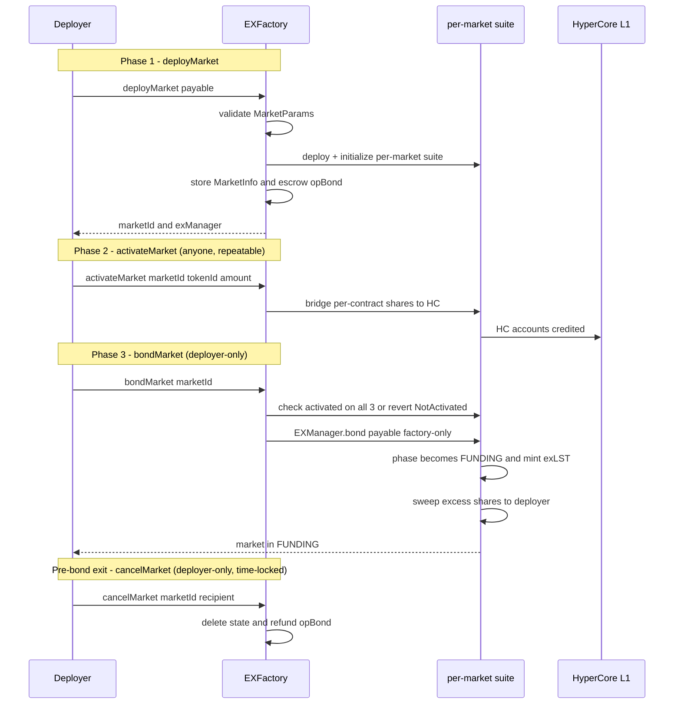

### Deposit Flow

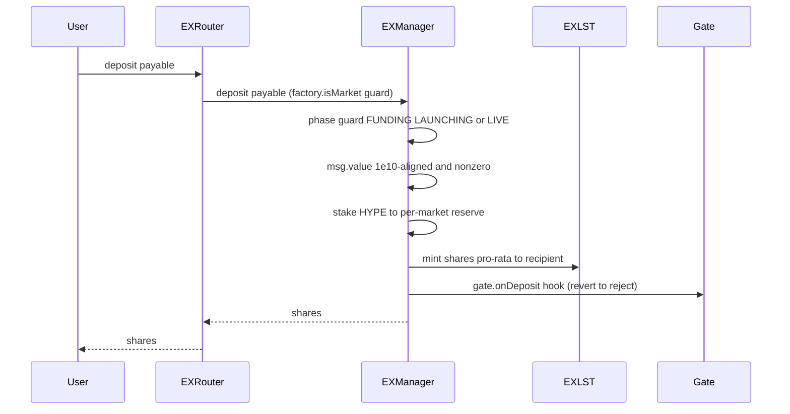

### Withdrawal Flow

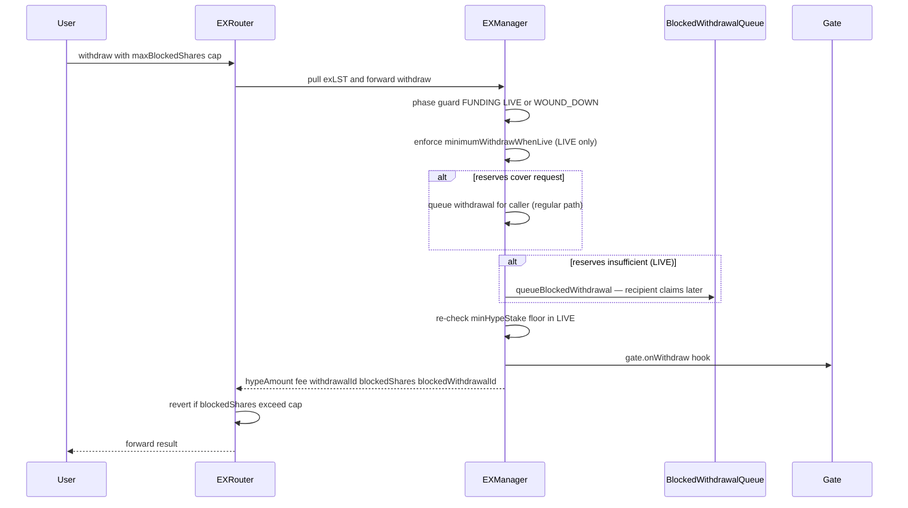

### Withdrawal Decision Tree

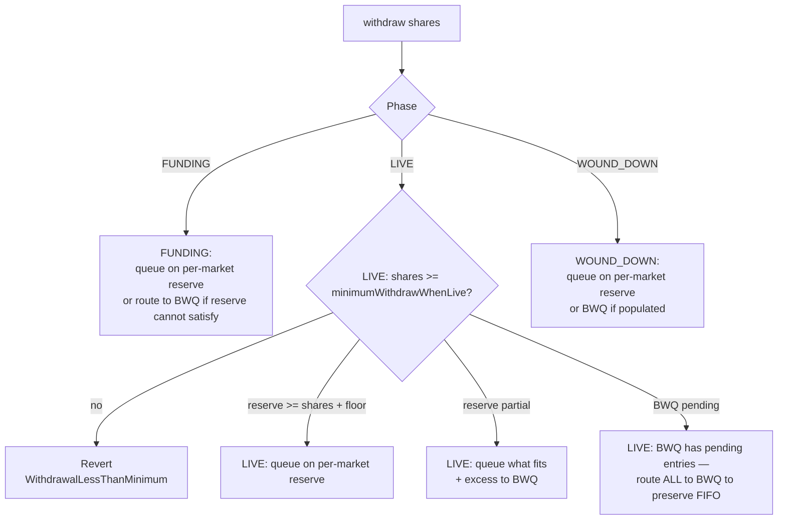

> **FIFO invariant:** when the BWQ has pending entries, new direct queueing is blocked — all new withdrawals route to BWQ to preserve FIFO ordering.

### Confirm Withdrawal Flow

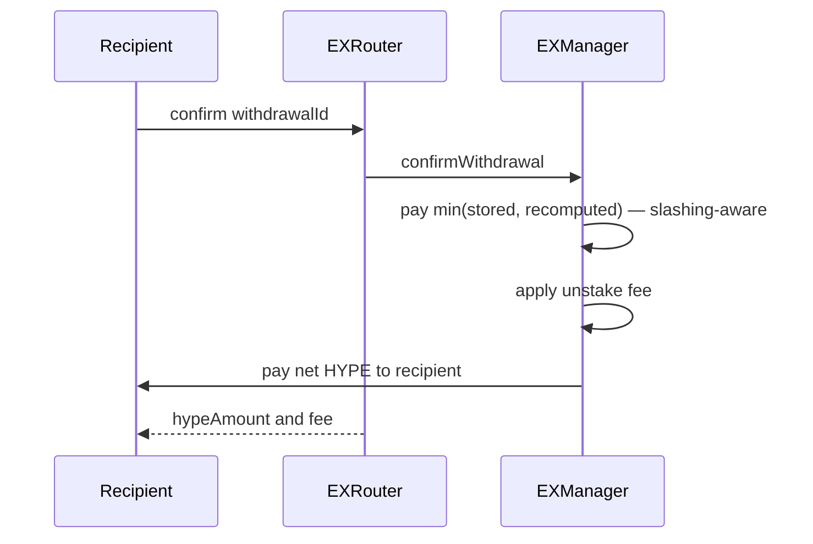

Blocked withdrawals confirm via `EXRouter.confirmBlockedWithdrawal` / `confirmAll`. Each batch's per-recipient HYPE share is paid out with the same slashing-aware adjustment (pro-rata scaling if the realized HYPE on confirm is less than the queue-time expectation).

### BlockedWithdrawalQueue Processing

`BlockedWithdrawalQueue.processBlockedWithdrawals(items)` is permissionless. Anyone can call it to advance the FIFO queue by up to `items` entries; each entry queues a withdrawal against the per-market reserve for later confirm. Per-entry sizing is bounded by the LIVE-phase reserve floor (`tier.minHypeStake`).

### Wallet Admin Flow

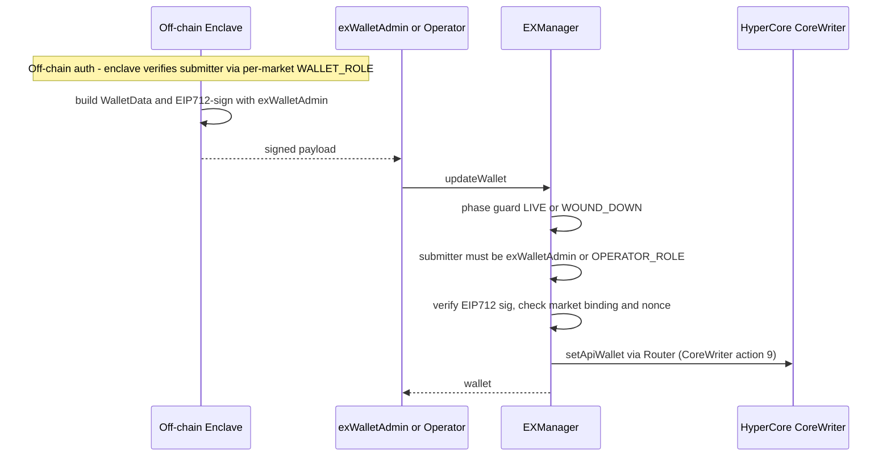

> **Replay defenses:** monotonic `walletNonce` per market + market-binding field block reuse. The submitter check (`exWalletAdmin || OPERATOR_ROLE`) lets the operator relay a pre-signed rotation if the enclave is offline.

### HC Attester Callbacks (link / release)

Two additional EXManager entrypoints exist for Kinetiq to attest HyperCore state that EVM cannot read directly:

- **`link(perpDexId, collateralTokenId, buybackWallet)`** — called by `globalConfig.exWalletAdmin` after Kinetiq runs the HC-side `perpDeploy`. Records the assigned dex id + collateral token + buyback wallet on the per-market EXManager. Unblocks `LaunchFeeSplitter.split()` and starts the HC perp-dex 183d unwind cliff (`linkTimestamp`).
- **`release(bool _coreUnwound)`** — called by `globalConfig.exWalletAdmin` to attest that the HC HIP-3 perp dex has begun (or aborted) unwinding. Gates the LIVE-phase `unwind()` finalize.

Both are Kinetiq-managed; operators and depositors do not call them. LIVE-phase `unwind()` finalize requires `release(true)` plus the 183d HC cliff elapsed; in FUNDING / LAUNCHING the HC cliff does not apply.

### Tier Upgrade Flow

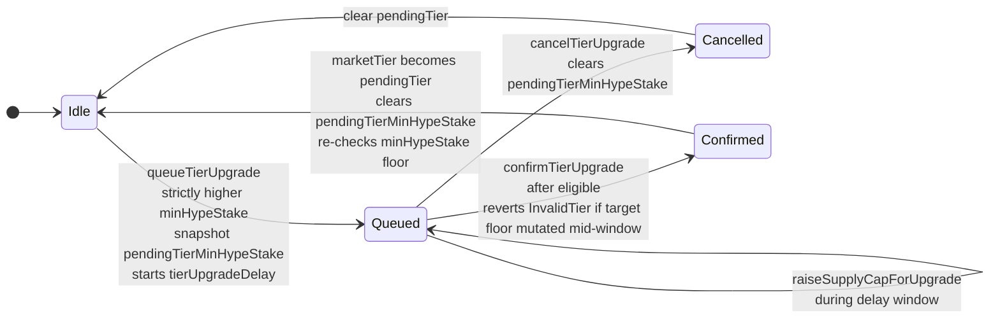

- **Strict-increase only.** Downgrades are forbidden because EVM `marketTier` and HyperCore HIP-3 commitment are independent — a downgrade on EVM would let withdrawals queue below what HyperCore actually undelegates, locking late depositors.
- **Floor relaxations** (Hyperliquid policy changes) flow through CONFIG_ADMIN on `GlobalConfig.queueLowerTierFloor` → `applyLowerTierFloor` (delay-protected; mutates an existing tier's floor atomically across all markets at that tier).
- **Pending-tier floor snapshot.** `queueTierUpgrade` records `pendingTierMinHypeStake = newTierConfig.minHypeStake` after the strict-increase check passes. `confirmTierUpgrade` reverts `InvalidTier` if the live target tier floor no longer matches the snapshot — protects against CONFIG_ADMIN lowering the target floor mid-window (via `queueLowerTierFloor` + `applyLowerTierFloor`) and silently turning an upgrade into a lateral move or downgrade. Snapshot cleared on confirm and cancel.
- `tierUpgradeRequiresCapRaise` is set at queue time if the new tier's `supplyCap` exceeds the current `EXLST.supplyCap()`. `confirmTierUpgrade` reverts unless the operator has called `raiseSupplyCapForUpgrade` (or the new tier's cap matches existing). `confirmTierUpgrade` also re-runs `_checkMinHypeStakeSatisfied` against the new tier.

### Fee Distribution Flow

HIP-3 trading fees accrue on the per-market HC perp dex. Kinetiq routes them three ways via a per-market `LaunchFeeSplitter` (CoreWriter `sendAsset`):

- **protocolFeeShare** (`globalConfig.protocolFeeShare`, initial 10%) → Kinetiq protocol treasury
- **deployer share** (`(1 - buybackBps)` of the post-protocol remainder) → `MarketParams.deployerTreasury` (deployer HC spot)
- **buyback share** (`MarketParams.buybackBps` of the post-protocol remainder) → per-market buyback wallet, which buys HYPE on HC spot and drips it back into the market reserve via a Kinetiq-managed throttle (`stakeFees` compounds the exLST rate without minting shares).

`MarketParams.buybackBps` is the deployer's lever: higher = more yield routed to exLST holders (including the deployer's own bonded position), lower = more direct revenue to `deployerTreasury`. Typical: ~10% (`buybackBps = 1000`).

### Unwind Flow

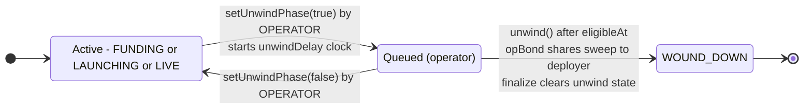

- **Operator lifecycle freeze during the unwind window.** Once `unwindEligibleAt != 0`, the operator's lifecycle ops revert `UnwindAlreadyQueued`: `fund`, `launch`, `addOperatorAuctionGas`, `queueTierUpgrade`, `raiseSupplyCapForUpgrade`, `confirmTierUpgrade`, plus the operator-relay branch of `updateWallet`. **Carve-outs stay open**: `deposit`, `withdraw`, `cancelTierUpgrade`, and the `exWalletAdmin` rotation branch of `updateWallet`.
- **Finalize.** `unwind()` sweeps `opBond` shares to the deployer and transitions to WOUND_DOWN (terminal). LIVE-phase finalize additionally requires Kinetiq's HC-attestation callbacks to have fired and the 183d HC perp-dex cliff to have elapsed (see [HC Attester Callbacks](#hc-attester-callbacks-link--release)).
- Kinetiq also retains a recovery path (`forceUnwindPhase`) for emergency scenarios; this does not affect the deployer/operator-driven flow above.

---

## Gate System

Gates implement `IEXGate` and are invoked by EXManager **after** core deposit/withdraw logic completes. A gate reverting rolls back the entire transaction (atomic) — making gate enforcement a post-execution veto rather than a pre-execution check. Gate ordering ensures that even without re-entrancy guards, external gate calls cannot manipulate in-progress state.

```solidity
function onDeposit(EXPhase, sender, recipient, tokenIn, amountIn, sharesOut, data) external;
function onWithdraw(EXPhase, sender, recipient, tokenOut, amountOut, withdrawalFee, sharesWithdrawn, blockedShares, data) external;
```

Gate selection happens at `deployMarket` (`MarketParams.gate`); `address(0)` means no gate (the typical choice for initial deployments).

### Gate trust model

- **Standard gates** (protocol-provided, audited) are reusable across markets.
- **Custom gates** (operator-deployed) are at the operator's discretion. Depositors must trust the gate code — protocol cannot audit every custom gate. Operators using custom gates should disclose this.

---

## Market Tier System

`GlobalConfig` maintains a 1-indexed immutable tier registry. Each tier defines:

```solidity
struct MarketTier {
    uint256 minHypeStake;  // Floor enforced at LIVE phase
    uint256 supplyCap;     // exLST supply cap at deploy
    string  name;          // Human-readable (e.g. "HIP-3", "HIP-4")
}
```

- `addTier` (CONFIG_ADMIN) appends; existing tiers cannot be replaced or deleted.
- Per-market `marketTier` is set at `deployMarket` and cached on EXManager. The market reads `globalConfig.marketTiers(marketTier).minHypeStake` at runtime via `_checkMinHypeStakeSatisfied`, `availableWithdrawals`, and `BWQ._withdrawableShares`.

### Operator-driven upgrade (3-step, strict-increase)

| Step | Function | Caller | Notes |
|---|---|---|---|
| 1 | `queueTierUpgrade(newTier)` | OPERATOR (LIVE) | Requires strictly greater `minHypeStake` than current tier. Sets `tierUpgradeEligibleAt = block.timestamp + globalConfig.tierUpgradeDelay()` and `tierUpgradeRequiresCapRaise` flag. **Snapshots `pendingTierMinHypeStake`**. Reverts `UnwindAlreadyQueued` if unwind window open. |
| 2 (optional) | `raiseSupplyCapForUpgrade()` | OPERATOR (LIVE) | Required if new tier's `supplyCap` > current. Calls `EXLST.setSupplyCap(newCap)` (increase-only). Reverts `UnwindAlreadyQueued` if unwind window open. |
| 3 | `confirmTierUpgrade()` | OPERATOR (LIVE) | After eligible. Verifies cap raised (if required) and reserves meet new floor. **Reverts `InvalidTier` if `newTierConfig.minHypeStake != pendingTierMinHypeStake`** (target floor mutated mid-window via `GlobalConfig.queueLowerTierFloor`+`applyLowerTierFloor`). Sets `marketTier = pendingTier`; clears the snapshot. Reverts `UnwindAlreadyQueued` if unwind window open. |
| Cancel | `cancelTierUpgrade()` | OPERATOR (LIVE) | Always allowed after eligible (including during the unwind window). Supply cap (if raised) persists. Clears `pendingTierMinHypeStake`. |

### Protocol-driven floor reduction

If Hyperliquid relaxes its HIP-3 minimum stake, CONFIG_ADMIN flows the change through `GlobalConfig.queueLowerTierFloor(tier, newFloor)` → wait `tierUpgradeDelay` → `applyLowerTierFloor(tier)`. The mutation is downward-only, delay-protected, and applies atomically across every market at that tier. Tier IDs and `supplyCap` are immutable; only the floor mutates. CONFIG_ADMIN can `cancelLowerTierFloor` before applying.

This separation ensures untrusted operators cannot induce floor reductions (would let withdrawals queue below L1 floor → permanent stake lock for late depositors), while CONFIG_ADMIN can track Hyperliquid policy externally attested.

---

## Slashing-Aware Withdrawals

HIP-3 markets can experience slashing on L1. To prevent a queued withdrawal from exiting at a stale pre-slashing rate, the confirm path pays the **smaller** of the rate at queue time and the rate at confirm time: `min(originalHypeAmount, recomputedHypeAmount)`. The unstake fee is taken from the adjusted amount before payout.

Blocked withdrawals (via the BWQ) get a pro-rata adjustment within each batch — if the realized HYPE on confirm is less than the queue-time expectation, each recipient's share scales down proportionally.

`EXRouter` exposes slashing-adjusted view helpers so depositor UIs always show the correct claimable amount:

- `userWithdrawalInfo(exManager, recipient)` — per regular withdrawal: claimable after fee + slashing.
- `blockedWithdrawalInfo(bwq, recipient)` — per blocked withdrawal: claimable batches after slashing pro-rata.

---

## Contract Documentation

### GlobalConfig

`src/GlobalConfig.sol` — protocol-level singleton. Holds shared parameters consumed by every per-market suite at runtime. Mutated by Kinetiq under `CONFIG_ADMIN_ROLE`. Deployer / operator / depositor-facing parameters:

| Parameter | Bounds | Why it matters |
|---|---|---|
| `unstakeFeeRate` | ≤ 10% | Withdrawal fee applied at confirm |
| `unwindDelay` | `[1 day, 90 days]` | Delay between `setUnwindPhase`/`cancelMarket` and finalize |
| `minLinkAgeForUnwind` | ≤ 365 days; mainnet default 183 days | HC perp-dex unwind cliff for LIVE-phase finalize |
| `minOperatorBond` | ≥ 100 HYPE (mainnet initial 1000 HYPE), multiple of 1e10 | Floor for `MarketParams.opBond` |
| `minStakeAmount` | `[0.1, 50] HYPE` | Floor for individual deposits |
| `minimumWithdrawWhenLive` | ≤ 100 HYPE worth | LIVE-phase withdrawal floor |
| `tierUpgradeDelay` | ≥ 1 day | Delay between `queueTierUpgrade` and `confirmTierUpgrade` |
| `protocolFeeShare` | ≤ 50% (mainnet initial 10%) | Kinetiq's slice of the post-Hyperliquid fee share |

**Tier registry:** `tierCount`, `marketTiers(tier)`, `addTier(name, minHypeStake, supplyCap)` (CONFIG_ADMIN, append-only). Per-tier floor reductions flow through `queueLowerTierFloor` → `applyLowerTierFloor` (delay-protected).

**Activation token registry:** `activationTokens(tokenId)` returns the metadata deployers need at `activateMarket` time — the ERC20 to approve, its decimals, and whether the path is direct or adapter-based. Read via `IGlobalConfig.activationTokens(tokenId)` / `isActivationToken(tokenId)` / `getActivationTokenIds()`.

### EXFactory

`src/EXFactory.sol` — protocol-level singleton; deploys per-market suites and tracks the registry.

**3-phase deploy lifecycle:**

```
deployMarket{value: opBond}(MarketParams)  →  marketId, exManager  (UNBONDED)
activateMarket(marketId, tokenId, amount)  →  L1 spot credit       (UNBONDED)
bondMarket(marketId)                        →  market in FUNDING
cancelMarket(marketId, recipient)           →  pre-bond exit (time-locked)
```

**`MarketParams`:**

```solidity
struct MarketParams {
    address admin;              // multisig that controls operator/admin/enclaver transfers
    address operator;           // OPERATOR_ROLE on EXManager
    address enclaver;           // WALLET_ROLE on EXManager (passive identifier for off-chain enclave auth)
    uint256 opBond;             // ≥ globalConfig.minOperatorBond(), 1e10-aligned; deployer-escrowed
    address validator;          // L1 validator (must be active in Kinetiq's approved validator set)
    address gate;               // address(0) for no gate
    string  lstName;            // EXLST token name
    string  lstSymbol;          // EXLST token symbol
    uint256 marketTier;         // 1-indexed; in [1, tierCount]
    address hyperCoreDeployer;  // HC-side identity for the EXLST Path-2 linker (may differ from EVM deployer)
    address deployerTreasury;   // deployer's HC spot for LFS payout; coreUserExists-gated at deployMarket
    uint64  buybackBps;         // deployer's chosen % of post-protocol-share remainder to LST compound loop; [0, BASIS_POINTS]
}
```

**`MarketInfo`** (factory-managed registry state, mutable on role transfers):

```solidity
struct MarketInfo {
    address deployer;          // immutable; bond capital owner
    address admin;             // mutable via transferAdmin
    address operator;          // mutable via transferOperator
    address enclaver;          // mutable via transferEnclaver
    uint256 nonce;             // immutable
    address exManager;         // immutable
    uint256 opBondEscrowed;    // cleared on bond / cancel
    uint256 cancelEligibleAt;  // snapshot at deploy
    bool    bonded;            // gates bond re-entry + cancel
}
```

**`MarketContracts`** — per-market suite returned by `getMarketContracts(marketId)`. Deployer/operator/depositor-relevant fields: `exManager`, `exLST`, `bwq` (BlockedWithdrawalQueue). The remaining fields are Kinetiq-managed LST infrastructure (Router, StakingAccountant, ValidatorManager, OracleManager, etc.) and the per-market fee distribution contracts.

**Registry views:** `getMarket(marketId)`, `getMarketContracts(marketId)`, `getMarketsByDeployer(deployer)`, `deployerNonce(deployer)`, `marketId(deployer, nonce)` (pure), `isMarket(exManager)`, `exManagerToMarketId(exManager)`, `predictNextDeployment(deployer)` (returns the suite of contract addresses the deployer's NEXT `deployMarket` call will produce), `activationTargets(marketId)` (returns the per-contract minimum amounts for `activateMarket`).

**Role transfers:** `transferOperator(marketId, newOperator)` (admin only) rotates the EXManager `OPERATOR_ROLE`. `transferAdmin(marketId, newAdmin)` (admin only) updates `MarketInfo.admin`. `transferEnclaver(marketId, newEnclaver)` (admin only) rotates the EXManager `WALLET_ROLE` holder.

**Activation:** `activateMarket(marketId, tokenId, amount)` accepts `amount >= totalRequired * 10**decimals` and refunds rounding dust to `msg.sender`. `deployerTreasury` is `coreUserExists`-gated at `deployMarket` so it must already exist on HyperCore.

### EXManager

`src/EXManager.sol` — per-market state machine. Operators interact with this contract directly; depositors and withdrawors go through `EXRouter`.

**Roles:**

| Role | Holder | Capability |
|---|---|---|
| `OPERATOR_ROLE` | Market operator (`MarketParams.operator`) | Lifecycle, `addOperatorAuctionGas`, `stakeFees`, tier flow, `updateWallet` (relay) |
| `WALLET_ROLE` | Market enclaver (`MarketParams.enclaver`) | Passive identifier for off-chain HC API-wallet auth (see [Enclaver / WALLET_ROLE](#enclaver--wallet_role)) |

**Functions** (operator + depositor surface; full ABI in `src/interfaces/IEXManager.sol`):

| Function | Phases | Caller | Notes |
|---|---|---|---|
| `bond()` payable | UNBONDED | factory | Mints exLST; sweeps excess to deployer; → FUNDING. Reverts `NotActivated` if not HC-activated. |
| `fund()` | FUNDING | OPERATOR | Reverts `MinHypeStakeNotSatisfied` if reserves < tier floor; reverts `UnwindAlreadyQueued` if unwind window open; → LAUNCHING |
| `launch(walletSignedData)` | LAUNCHING | OPERATOR | EIP712 sig check; sets API wallet on HC; reverts `UnwindAlreadyQueued` if unwind window open; → LIVE |
| `deposit(recipient, data)` payable | FUNDING/LAUNCHING/LIVE | anyone | 1e10-aligned; mints pro-rata exLST; gate hook; open during unwind window |
| `withdraw(shares, recipient, data)` | FUNDING/LIVE/WOUND_DOWN | exLST holder | LIVE: enforces `minimumWithdrawWhenLive` + reserves invariant; routes excess to BWQ. Open during unwind window. |
| `confirmWithdrawal(id, recipient)` | any | anyone | Slashing-aware payout; fee → Kinetiq treasury; HYPE → recipient |
| `stakeFees()` payable | LIVE/WOUND_DOWN | anyone | Compounds without minting; used by the fee-distribution flow |
| `addOperatorAuctionGas()` payable | LIVE | OPERATOR | 1e10-aligned; bridges HYPE to L1 spot for HIP-3 auction prepayment; reverts during unwind window |
| `setUnwindPhase(bool)` | FUNDING/LAUNCHING/LIVE | OPERATOR | Sets/clears operator unwind queue. Cancel (`false`) blocked once Kinetiq has attested HC release. |
| `unwind()` | FUNDING/LAUNCHING/LIVE | OPERATOR | After `unwindEligibleAt`; sweeps `opBond` to deployer; → WOUND_DOWN. LIVE-phase finalize additionally requires Kinetiq's HC-attestation callbacks + the 183d HC perp-dex cliff. |
| `updateWallet(walletSignedData)` | LIVE/WOUND_DOWN | `exWalletAdmin` or OPERATOR | Admin EIP712 sig required regardless of submitter. Operator-relay branch frozen during unwind window. |
| `queueTierUpgrade(newTier)` | LIVE | OPERATOR | Strict-increase only; snapshots target floor; reverts `UnwindAlreadyQueued` if unwind window open |
| `raiseSupplyCapForUpgrade()` | LIVE | OPERATOR | Increase-only; sets EXLST supply cap; reverts `UnwindAlreadyQueued` if unwind window open |
| `confirmTierUpgrade()` | LIVE | OPERATOR | Verifies cap raise + reserves; reverts `InvalidTier` if target tier floor mutated mid-window |
| `cancelTierUpgrade()` | LIVE | OPERATOR | After eligible; open during unwind window |

Kinetiq additionally calls `link` / `release` (HC attester callbacks) and holds a recovery path (`forceUnwindPhase`); these are documented in the protocol repository.

### EXLST

`src/EXLST.sol` — per-market share token held by depositors. ERC20 + ERC20Permit + ERC20Votes; mint/burn are EXManager-only. Supply cap is set at deploy from the market tier and can only be increased (via `raiseSupplyCapForUpgrade` during a tier upgrade).

`HyperCoreAsset` slot records the HC-side deployer (`MarketParams.hyperCoreDeployer`) for linking the EVM EXLST to a HyperCore spot asset.

### EXRouter

`src/EXRouter.sol` — stateless user entrypoint; **shared singleton** across all markets. Validates `exManager` on every call via `factory.isMarket(address(exManager))`.

| Function | Forwards to | Notes |
|---|---|---|
| `deposit(exManager, recipient, data)` payable | `exManager.deposit{value}(recipient, data)` | — |
| `withdraw(exManager, sharesIn, recipient, maxBlockedShares, data)` | `exManager.withdraw(...)` | Pulls exLST in, increases allowance, reverts `BlockedSharesExceedMax` |
| `confirm(exManager, id, recipient)` | `exManager.confirmWithdrawal(...)` | — |
| `confirmBlockedWithdrawal(exManager, id, batchIndices)` | `exManager.blockedWithdrawalQueue().confirmBlockedWithdrawal(...)` | Reads BWQ from EXManager |
| `confirmAll(exManager, withdrawalIds, blockedIds, queuedBatchIndicesPerWithdrawal, recipient)` | aggregates regular + blocked | — |

**Slashing-adjusted view helpers (for depositor UIs):**
- `userWithdrawalInfo(exManager, recipient)` — per regular withdrawal: claimable HYPE after fee + slashing, `delayDeadline`, `withdrawable`
- `blockedWithdrawalInfo(bwq, recipient)` — per blocked withdrawal: claimable batches (after slashing pro-rata) + processing batches with deadlines
- `queueWithdrawalAvailability(exManager) → (instant, processable, blocked, delay, minWithdrawal)`
- `phase(exManager)`, `hypeToExLst(exManager, amount)`, `exLstToHype(exManager, shares)`, `withdrawalDelay(exManager, phase)`

### BlockedWithdrawalQueue

`src/BlockedWithdrawalQueue.sol` — per-market FIFO queue. Withdrawors interact via `EXRouter.confirmBlockedWithdrawal` / `confirmAll`.

| Function | Caller | Notes |
|---|---|---|
| `processBlockedWithdrawals(items)` | anyone | Advances the FIFO queue by up to `items` entries. Typically called by a Kinetiq bot, but anyone may call. |
| `confirmBlockedWithdrawal(id, batchIndices)` | anyone | Confirms each batch; pro-rata slashing-adjusts; pays HYPE to recipient + fee to Kinetiq treasury |
| `processableShares()` / `totalBlockedQueue()` | view | Pre-flight + queue-length helpers |

### Gate Contracts

See [Gate System](#gate-system) for full mechanics. Source under `src/gate/`.

---

## Token Mechanics & Accounting

### Reserve Asset Model

Deposits stake HYPE into the per-market reserve. The per-market reserve accrues HIP-3 staking yield, applies slashing if any, and gets compounded by the Kinetiq-managed buyback loop. Depositors hold `exLST` shares against that reserve.

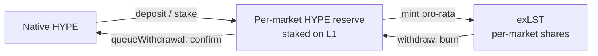

The exLST → HYPE rate appreciates with staking yield and the buyback compound loop; it depreciates with slashing. EXManager view helpers `HYPEToEXLST(amount)` and `EXLSTToHYPE(shares)` convert between the two using the current rate.

### Share-Math Primitives

Mint/burn math is pro-rata to the underlying HYPE reserves:

- `mintShares = supply == 0 ? amount : mulDiv(totalSupply, amount, reserves)`
- `burnAmount = mulDiv(shares, reserves, totalSupply)`

A single `unstakeFee = mulDiv(amount, globalConfig.unstakeFeeRate(), 10_000)` is applied **exactly once** per withdrawal, paid at confirm time to the Kinetiq treasury.

### Fee Model

```
HIP-3 trading fees (100%)
├── 50% → Hyperliquid (fixed by HIP-3)
└── 50% → HIP-3 Deployer (= per-market Router; market-side identity)
        ├── globalConfig.protocolFeeShare% → Kinetiq treasury
        ├── (1 - buybackBps) of remainder → MarketParams.deployerTreasury (deployer HC spot)
        └── buybackBps of remainder → per-market buyback loop → compounds exLST rate
```

Initial `protocolFeeShare = 1000` (10% of the operator's 50% share = 5% of total trading fees). `buybackBps` is set per-market by the deployer at `deployMarket`.

A separate 10% staking-yield reward share is split off the per-market reserve and routed between the deployer wallet (70%) and the Kinetiq treasury (30%).

### Decimal Alignment

HyperEVM HYPE is **18-decimal native**; HyperCore HYPE is **8-decimal**. The bridge silently truncates sub-1e10 wei. Every payable entrypoint in EXManager and EXFactory enforces `msg.value % 1e10 == 0` (deposit, bond, `addOperatorAuctionGas`, `deployMarket`'s `opBond`).

Activation tokens use HIP-1's per-token decimals; deployers read `globalConfig.activationTokens(tokenId).decimals` to size the activation amount.

---

## Invariants & Security

### Critical Invariants

| Invariant | Why it matters |
|---|---|
| **Slashing-aware confirm payout ≤ stored** | Queued withdrawors cannot exit at a stale pre-slashing rate; remaining holders are protected |
| **Tier upgrade strictly increases minHypeStake** | Downgrade would let withdrawals queue below L1 stake, locking late depositors |
| **LIVE-phase reserves ≥ tier minHypeStake** | Protects the active HIP-3 market — direct withdrawals above the floor route to BWQ |
| **EXLST.totalSupply() ≤ supplyCap** | Tier-cap enforcement on the per-market share token |
| **availableWithdrawals == 0 when BWQ has pending** | FIFO ordering — new withdrawors cannot jump ahead of pending blocked entries |
| **HYPE-denominated params multiple of 1e10** | Sub-1e10 dust is silently truncated by the L1 bridge |
| **Bond ownership belongs to deployer** | Deployer escrows `opBond` at `deployMarket`, receives excess shares at `bond`, and reclaims bond shares at `unwind` |
| **marketId = keccak256(deployer, nonce); front-run resistant** | Other addresses cannot collide on a deployer's marketId |
| **WOUND_DOWN is terminal** | Once finalized, market state cannot re-enter Active phases |

### Security Mechanisms

- **Re-entrancy:** `nonReentrant` on `EXManager.deposit`, `withdraw`, `confirmWithdrawal`, `stakeFees`; `BlockedWithdrawalQueue.processBlockedWithdrawals`, `confirmBlockedWithdrawal`. Native HYPE paid to recipient last.
- **Access control:** AccessControlEnumerable per contract. Operator/admin/enclaver are deployer-chosen at `deployMarket` and rotatable via `EXFactory.transferOperator`/`transferAdmin`/`transferEnclaver`.
- **Signature verification:** EIP712 on wallet rotation, with monotonic per-market nonce + market-binding field to block cross-market replay.
- **Pause:** Kinetiq-controlled `PauserRegistry` can pause EXManager + EXLST hot paths.
- **Upgrade safety:** Beacon proxies for atomic per-type upgrades; initializers disabled on implementations.
- **Factory-only auth:** `EXManager.activate` and `bond` revert if `msg.sender != factory`.

---

## Integration Guides

### User Integration

```solidity
// 1. Look up market by deployer + nonce
bytes32 mid = factory.marketId(deployer, nonce);   // pure
EXFactory.MarketInfo memory info = factory.getMarket(mid);
EXFactory.MarketContracts memory contracts = factory.getMarketContracts(mid);

// 2. Deposit HYPE
exRouter.deposit{value: amount}(IEXManager(info.exManager), recipient, gateData);

// 3. Withdraw exLST → queue HYPE
(uint256 hypeAmount, uint256 hypeFee, uint256 wid, uint256 blockedShares, uint256 bwid) =
    exRouter.withdraw(IEXManager(info.exManager), shares, recipient, maxBlockedShares, gateData);

// 4. Confirm regular withdrawal
exRouter.confirm(IEXManager(info.exManager), wid, recipient);

// 5. Confirm blocked withdrawal (anyone — typically a bot)
IBlockedWithdrawalQueue(contracts.bwq).processBlockedWithdrawals(/*items*/ 10);
exRouter.confirmBlockedWithdrawal(IEXManager(info.exManager), bwid, batchIndices);

// 6. Aggregate confirms
exRouter.confirmAll(IEXManager(info.exManager), wids, bwids, queuedBatchIndicesPerBwid, recipient);

// 7. UI helpers
IEXRouter.WithdrawalInfo[] memory pending = exRouter.userWithdrawalInfo(IEXManager(info.exManager), recipient);
(uint256 instant, uint256 processable, uint256 blocked, uint256 delay, uint256 minWithdraw) =
    exRouter.queueWithdrawalAvailability(IEXManager(info.exManager));
```

### Operator Guide

Pre-deploy:

- Acquire `opBond ≥ globalConfig.minOperatorBond()` (multiple of 1e10).
- Acquire the activation token (ERC20 from `globalConfig.activationTokens` — e.g. USDC).
- Pick a market admin (multisig), a market operator (EOA or multisig), and a market enclaver.
- Pick `lstName` / `lstSymbol` (EXLST token metadata).
- Pick `marketTier` from `globalConfig.marketTiers` and a validator from Kinetiq's approved set.
- Pick `buybackBps` (split between deployer treasury revenue and the exLST compound loop).
- Optional: deploy or pick a gate (MultiplexerGate + WhitelistGate for FUNDING + TieredMintGate for LIVE is a typical stack).

Deploy:

```solidity
EXFactory.MarketParams memory p = EXFactory.MarketParams({
    admin: 0x...,            operator: 0x...,         enclaver: 0x...,
    opBond: 1000 ether,      validator: 0x...,
    gate: address(0),        lstName: "Acme Markets LST",  lstSymbol: "amHYPE",
    marketTier: 1,           hyperCoreDeployer: 0x...,
    deployerTreasury: 0x..., buybackBps: 1000
});
(bytes32 mid, address exManager) = factory.deployMarket{value: 1000 ether}(p);

// Approve activation token to factory
IERC20(usdc).approve(address(factory), 1e6);
factory.activateMarket(mid, /*tokenId*/ usdcTokenId, 1e6);

// Wait for L1 to credit, then bond
factory.bondMarket(mid);
// → market is now FUNDING; depositors can stake HYPE
```

Lifecycle:

- Once reserves ≥ tier `minHypeStake`, call `IEXManager(exManager).fund()`.
- Coordinate with Kinetiq for the wallet-admin-signed `WalletData`. Call `IEXManager(exManager).launch(walletSignedData)`. Kinetiq then runs the HC `perpDeploy` and attests via `link()`.
- Tier upgrades: `queueTierUpgrade(newTier)` → wait `tierUpgradeDelay` → optionally `raiseSupplyCapForUpgrade()` → `confirmTierUpgrade()`.
- Voluntary unwind: `setUnwindPhase(true)` → wait `unwindDelay` (and the 183d HC cliff for LIVE markets) → `unwind()`.

---

## Technical Details

- **Solidity:** 0.8.34 pinned in `foundry.toml`; `evm_version = cancun` (HyperEVM target).
- **HyperEVM ↔ HyperCore boundary:**
  - Native HYPE bridge: `0x2222…2222`. HyperEVM HYPE is 18-decimal, HyperCore HYPE is 8-decimal; the bridge silently truncates sub-1e10 wei. Every payable entrypoint enforces `% 1e10 == 0`.
  - Per-token system address: `0x20 || tokenId padded to 19 bytes` → 20-byte address. Resolve via `globalConfig.activationTokens(tokenId).systemAddress`.
  - CoreWriter (`0x3333…3333`) action 9 (`addApiWallet`) fires on `launch` and `updateWallet`.
  - HyperCore Path-2 finalizer slot on EXLST stores `MarketParams.hyperCoreDeployer` — the HC-side ticker owner. Pass `msg.sender` if same as the EVM deployer; pass the HC-side ticker buyer wallet if different.

---

## Architecture Summary

```mermaid
graph TB
    subgraph "User Journey"
        U1[User deposits HYPE] --> U2[Receives EXLST shares]
        U2 --> U3[Market goes LIVE]
        U3 --> U4[User withdraws EXLST]
        U4 --> U5{Available?}
        U5 -->|Yes| U6[Queue withdrawal]
        U5 -->|No| U7[Queue blocked withdrawal]
        U6 --> U8[Confirm after delay]
        U7 --> U9[Wait for processing]
        U9 --> U10[Claim when ready]
    end

    subgraph "Operator Journey"
        O1[Deploy market] --> O2[Post bond - FUNDING]
        O2 --> O3[Wait for deposits]
        O3 --> O4[Fund - LAUNCHING]
        O4 --> O5[Get wallet signature]
        O5 --> O6[Launch - LIVE]
        O6 --> O7[Market operates]
        O7 --> O8[Queue unwind]
        O8 --> O9[Wait delay]
        O9 --> O10[Unwind - WOUND_DOWN]
    end

    subgraph "System Components"
        S1[GlobalConfig] -.config.-> S2[EXManager]
        S2 --> S3[EXLST Token]
        S2 --> S4[HC perp dex<br/>API wallet]
        S2 --> S5[BlockedWithdrawalQueue]
        S6[EXRouter] -.routes.-> S2
    end

    style U8 fill:#90EE90,color:#000
    style U10 fill:#90EE90,color:#000
    style O10 fill:#FFE5B4,color:#000
    style S2 fill:#FFB6C1,color:#000
```

---

## License

Most contracts are BUSL-1.1 (Business Source License 1.1). Interfaces, libraries, and helpers are MIT (see SPDX header on each file).
