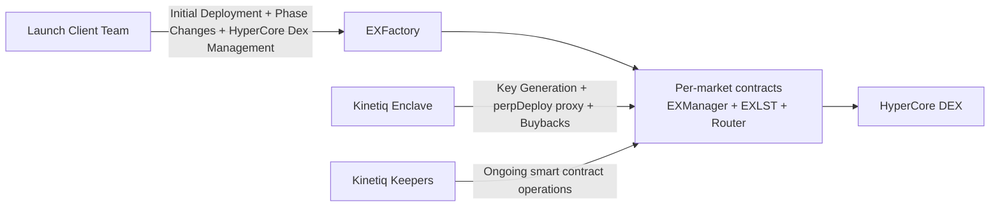
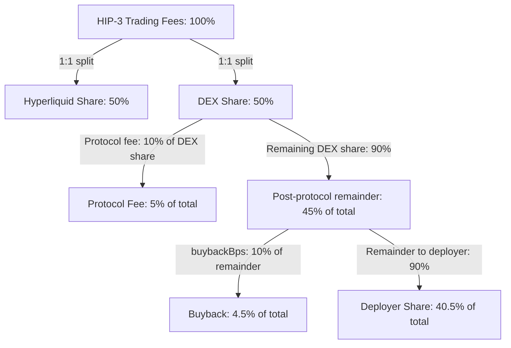

# Kinetiq Launch Deployer Onboarding

## Introduction

This document defines the onboarding process for your team as an initial launch deployer on Kinetiq Launch.
It covers:
- Required smart-contract deployment configuration.
- Required on-chain operator actions and lifecycle timing.
- Enclave and sub deployer scope managed by Kinetiq during onboarding.

During onboarding, Kinetiq provides white-glove operational support through market go-live. Your team retains control of designated operator permissions and approved `perpDeploy` actions.

Please populate the provided json template with desired values for the deployment configuration, as well as the hypercore configuration, using the document below as a reference.

## High-Level Architecture

### Component Roles

1. Smart Contracts  
   Per-market contracts manage fundraising, HIP-3 capital requirements, and staking accounting. Each market has its own staking manager stack deployed via `EXFactory`.

2. Enclave  
   The enclave is an air-gapped service used for API-agent key generation and signing workflows. Keys are generated in-enclave and stored with envelope encryption.

3. Keepers  
   Kinetiq-operated keepers handle ongoing staking and operational maintenance, including rebalancing, queue processing, and validator-performance routines.

## Smart Contract Deployment

Your market is deployed by the launch client team through `EXFactory.deployMarket{value: opBond}(MarketParams)` as a full per-market contract suite.

### Deployment Configuration

| Field | Type | Required | Description |
| --- | --- | --- | --- |
| `admin` | `address` | Yes | Your market admin address (typically multisig). Can transfer operator/admin/enclaver via factory functions. |
| `operator` | `address` | Yes | Your operator address, which receives `OPERATOR_ROLE` on `EXManager`. |
| `enclaver` | `address` | Yes | Receives `WALLET_ROLE` on `EXManager` for enclave-authorized `perpDeploy` paths. While Kinetiq will be whitegloving enclave operations, this value will be irrelevent. |
| `opBond` | `uint256` | Yes | Operator bond amount. Must satisfy `globalConfig.minOperatorBond()`, and be provided as `msg.value` on the `deployMarkets` call. This stake will be locked until the market wind down is complete. |
| `validator` | `address` | Yes | Your selected L1 validator address. |
| `gate` | `address` | Optional | Optional gate contract for access policy (`address(0)` disables gate checks). |
| `lstName` | `string` | Yes | `EXLST` token name. |
| `lstSymbol` | `string` | Yes | `EXLST` token symbol. |
| `marketTier` | `uint256` | Yes | 1-indexed market tier controlling `minHypeStake` and supply-cap constraints. |
| `hyperCoreDeployer` | `address` | Yes | HyperCore-side deployer reference for linker/integration flows. |
| `deployerTreasury` | `address` | Yes | Treasury receiving your deployer share of HIP-3 revenue. |
| `buybackBps` | `uint64` | Yes | Buyback share in basis points, applied to remainder after protocol fee. The remaining share goes to the deployer.|

Initial HIP-3 market tier configuration (Tier 1):
- `minHypeStake = 500_000`
- `exLSTSupplyCap = 750_000`

#### Example Fee Split Diagram

Example with total fees = 100%
- Hyperliquid: 50%
- Protocol fee (10% of DEX 50%): 5%
- Remaining DEX after protocol fee: 45%
- Buyback (10% of 45%): 4.5%
- Deployer share (remaining 90% of 45%): 40.5%

Note: This example assumes the 1.0 deployerFeeShare(1:1 HL/Deployer split.), `buybackBps = 1000` (operator configured), and `protocolFeeShare = 1000` (configured by Kinetiq). This is the `protocolFeeShare` at rollout but it is subject to change.

### Deployment and Pre-Launch Sequence

1. Your deployer executes `EXFactory.deployMarket{value: opBond}(MarketParams)`.
2. Your deployer executes `EXFactory.activateMarket(...)` with required activation tokens.
3. Your deployer executes `EXFactory.bondMarket(...)` to finalize bonding into `EXManager`.
4. Your operator executes `EXManager.fund()` when reserves meet tier minimum stake (`FUNDING -> LAUNCHING`).
5. Your operator executes `EXManager.launch(walletSignedData)` after `fund()` succeeds (`LAUNCHING -> LIVE`).  
   Kinetiq UI support will provide the signed wallet payload for this action.

## Required Operator Smart Contract Calls

Operator actions are phase-gated in `EXManager`.

**UI support:** Kinetiq provides UI flows for these calls so your team does not need to submit raw calldata.

| Function | Contract to Call | Who Calls | Required Phase/State | Purpose | Timing |
| --- | --- | --- | --- | --- | --- |
| `bondMarket(...)` (calls `EXManager.bond()`) | `EXFactory` | Your market deployer | `EXManager` in `UNBONDED` and market activated | Finalizes bonding. `EXManager.bond()` is factory-gated (`msg.sender == factory`). | After `activateMarket(...)`, before `fund()`. |
| `fund()` | `EXManager` | Your `OPERATOR_ROLE` address | `FUNDING` | Verifies minimum stake and transitions to `LAUNCHING`. | Once reserves satisfy tier minimum. |
| `launch(walletSignedData)` | `EXManager` | Your `OPERATOR_ROLE` address | `LAUNCHING` | Sets API wallet from signed payload and transitions to `LIVE`. | Immediately after `fund()` succeeds. |

## Enclave and Sub Deployers

During onboarding, Kinetiq manages enclave setup and initial sub deployer configuration for your market.

### Kinetiq-Managed Scope

- Enclave setup for API-wallet operations.
- First `registerAsset` request (initial DEX and market setup).
- Enablement of approved sub deployers requested by your team.

### Sub Deployer Policy

Kinetiq supports requested sub deployer variants except `SetFeeRecipient`.

- Supported by request: `RegisterAsset`, `SetOracle`, `SetFundingMultipliers`, `SetFundingInterestRates`, `HaltTrading`, `SetMarginTableIds`, `SetOpenInterestCaps`, `InsertMarginTable`, `SetGrowthModes`, `SetMarginModes`, `SetPerpAnnotation`.
- Not enabled for clients by design: `SetFeeRecipient`.

This exclusion protects fee routing for buyback and restaking infrastructure.

If Hyperliquid adds new variants, Kinetiq can review and enable additional actions where they do not conflict with smart-contract safety or protocol operations.

**Note:** In the future, Launch clients will be provided with UI or an SDK for interacting with the enclave for the first `registerAsset` request and sub deployer configuration.
