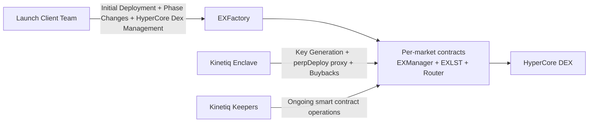
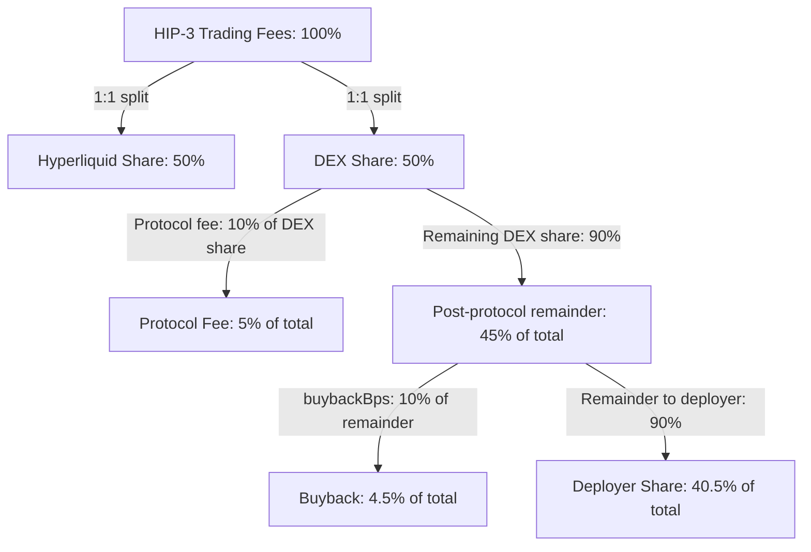
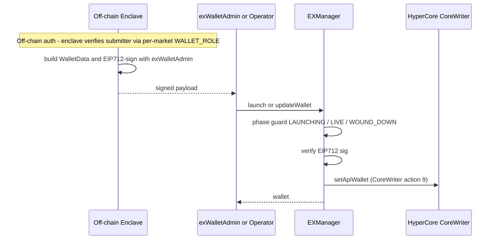

# Kinetiq Launch Deployer Onboarding

## Introduction

This document defines the onboarding process for your team as an initial launch deployer on Kinetiq Launch.
It covers:
- Required smart-contract deployment configuration.
- Required on-chain operator actions and lifecycle timing.
- Enclave and sub deployer scope managed by Kinetiq during onboarding.

During onboarding, Kinetiq provides white-glove operational support through market go-live. Your team retains control of designated operator permissions and approved `perpDeploy` actions.

Please populate the provided json template with desired values for the deployment configuration, as well as the hypercore configuration, using the document below as a reference.

## High-Level Architecture

### Component Roles

1. Smart Contracts  
   Per-market contracts manage fundraising, HIP-3 capital requirements, and staking accounting. Each market has its own staking manager stack deployed via `EXFactory`.

2. Enclave  
   The enclave is an air-gapped service used for API-agent key generation and signing workflows. Keys are generated in-enclave and stored with envelope encryption.

3. Keepers  
   Kinetiq-operated keepers handle ongoing staking and operational maintenance, including rebalancing, queue processing, and validator-performance routines.

## Smart Contract Deployment

Your market is deployed by the launch client team through `EXFactory.deployMarket{value: opBond}(MarketParams)` as a full per-market contract suite.

### Deployment Configuration

The deployer's market config (your filled-in copy of `TEMPLATE.json`) carries the `evm.marketParams` block that the deploy script reads. Two categories:

- **Fields you set** — you fill these in under `evm.marketParams`.
- **Fields pinned by Kinetiq** — set in `script/config/globals/<network>.json` and merged in automatically at deploy time. You don't touch these.

#### Fields you set (`evm.marketParams`)

| Field | Type | Required | Description |
| --- | --- | --- | --- |
| `admin` | `address` | Yes | The address (typically your governance multisig) that controls role transfers via the factory: `EXFactory.transferOperator` / `transferAdmin` / `transferEnclaver`. It does **not** hold the lifecycle `OPERATOR_ROLE` itself — it's the meta-authority that can rotate the operator if needed. |
| `operator` | `address` | Yes | The address that receives `OPERATOR_ROLE` on `EXManager` and drives the market lifecycle: `fund()` (FUNDING → LAUNCHING), `launch()` (LAUNCHING → LIVE), `updateWallet()` relay, voluntary `setUnwindPhase()` / `unwind()`. Can be an EOA or multisig. Day-to-day market ops happen from this address. |
| `opBond` | `uint256` | Yes | Operator bond in wei. Must satisfy `globalConfig.minOperatorBond()` (mainnet floor 1000 HYPE) and be 1e10-aligned (HYPE bridges at 8 decimals on HC). Sent as `msg.value` on `deployMarket`. The bond is locked until the market fully winds down; on `unwind()` finalize the bond shares sweep back to the deployer EOA. |
| `validator` | `address` | Yes | Your chosen L1 validator for the per-market staking layer. Must be active in Kinetiq's approved validator set (the deploy script pre-flight asserts `validatorActiveState(validator) == true` and reverts otherwise). The validator earns delegation rewards which flow through the per-market reward share split. |
| `gate` | `address` | Optional | Optional `IEXGate` contract for access control on deposits/withdrawals. Set `address(0)` for no gate (the typical initial market setup). If set, the gate's `onDeposit` / `onWithdraw` hooks fire after every action and can revert to reject. Standard gates: `WhitelistGate` (EIP712 sigs + tiered caps), `TieredMintGate` (token-lock-based allowance), `CompositeGate` (AND-compose). |
| `lstName` | `string` | Yes | ERC20 `name()` of your per-market `EXLST` share token (e.g. `"Acme Markets Liquid Stake"`). Visible to depositors in wallets and explorers. |
| `lstSymbol` | `string` | Yes | ERC20 `symbol()` of your `EXLST` token (e.g. `"amHYPE"`). Convention: market-prefix + `HYPE`. |
| `hyperCoreDeployer` | `address` | Yes | The HyperCore-side spot address responsible for the HC spot asset paired with your `EXLST` EVM contract — the address that buys the ticker on the HC auction and deploys the spot asset (typically **after** the EVM `EXLST` is deployed, though the order isn't enforced). Used by HyperCore's Path-2 linker to associate the EVM `EXLST` ERC20 with its HC spot counterpart. **Not** necessarily the same wallet as the EVM-side `deployMarket` caller — the HC asset deploy and the EVM market deploy are independent operations. |
| `deployerTreasury` | `address` | Yes | Your treasury address on **HyperCore spot** (not EVM). Receives your share of HIP-3 trading fees via the per-market `LaunchFeeSplitter` (`CoreWriter.sendAsset`). Must already be **activated** on HyperCore — the factory's `deployMarket` asserts `coreUserExists(deployerTreasury)` and reverts if not. |
| `buybackBps` | `uint64` | Yes | Basis points (0–10000) of the post-protocol-fee remainder routed to the per-market buyback loop (compounds the `EXLST` rate, benefits depositors + your bonded share). The remainder of the remainder goes to `deployerTreasury` as direct revenue. Typical mainnet value: `1000` (10%). See the fee-split diagram below for a worked example. |

`evm.cancelRecipient` (top-level, **optional**) — destination address for the `opBond` refund if you cancel the market pre-bond via `cancelMarket`. Defaults to `msg.sender` at `cancelMarket` time if unset. Useful when the deploy and cancel transactions are signed from different EOAs.

#### Fields pinned by Kinetiq (`script/config/globals/<network>.json`)

These ship with the repo under `script/config/globals/` (one file per network) and are merged in automatically when the deploy script reads your market config. You do not need to set them.

| Field | Description |
| --- | --- |
| `enclaver` | Per-market address holding `WALLET_ROLE` on `EXManager`. Passive identifier the off-chain Kinetiq enclave reads (`hasRole(WALLET_ROLE, requester)`) to authenticate HC-side API-wallet requests for your market. Kinetiq pins this; rotatable later via `EXFactory.transferEnclaver` (admin-only). |
| `marketTier` | 1-indexed market tier from `globalConfig.marketTiers`. Each tier defines `minHypeStake` (the LIVE-phase reserve floor below which withdrawals get blocked into the BWQ) and `supplyCap` (the `EXLST` mint cap). Kinetiq pins to tier 1 (HIP-3 default) in globals. |

Initial HIP-3 market tier 1 configuration **per network**:
- **mainnet** — `minHypeStake = 500_000` HYPE, `exLSTSupplyCap = 750_000` HYPE-equivalent.
- **mainnet-dryrun** — `minHypeStake = 4` HYPE, `exLSTSupplyCap = 6` HYPE-equivalent. Test-sized so deployers can rehearse FUNDING → LAUNCHING end-to-end.
- **testnet** — `minHypeStake = 100` HYPE, `exLSTSupplyCap = 150` HYPE-equivalent. Same intent as dryrun.

Live values verifiable via `cast call <GlobalConfig> marketTiers(uint256)((uint256,uint256,string)) 1` against the address in `script/config/globals/<network>.json`.

#### Example Fee Split Diagram

Example with total fees = 100%
- Hyperliquid: 50%
- Protocol fee (10% of DEX 50%): 5%
- Remaining DEX after protocol fee: 45%
- Buyback (10% of 45%): 4.5%
- Deployer share (remaining 90% of 45%): 40.5%

Note: This example assumes the 1.0 deployerFeeShare(1:1 HL/Deployer split.), `buybackBps = 1000` (operator configured), and `protocolFeeShare = 1000` (configured by Kinetiq). This is the `protocolFeeShare` at rollout but it is subject to change.

### Core (HyperCore) Configuration

The `core` block in your market config describes the HyperCore-side perp dex registration. Kinetiq submits these to HyperCore on your behalf during onboarding — you don't run `perpDeploy` directly.

#### `core.registerAsset.assetRequest`

The HC perp asset definition.

| Field | Type | Description |
| --- | --- | --- |
| `coin` | `string` | Your perp's ticker symbol (e.g. `"ABC"`, `"XYZ-PERP"`). What traders see on the orderbook. |
| `szDecimals` | `uint8` | Decimals of precision for order sizes. Typical 2–6 depending on price magnitude — lower for high-priced assets, higher for low-priced. |
| `oraclePx` | `string` | Initial oracle price as a decimal string (e.g. `"1.0"`, `"1234.56"`). Set to a reasonable starting mark; the oracle adapter takes over after launch. |
| `marginTableId` | `uint32` | References the HC margin table that defines initial/maintenance margin tiers + liquidation params for your perp. Default `1` unless coordinated with Kinetiq for custom leverage / risk parameters. |
| `onlyIsolated` | `bool` | `true` to force isolated-margin only for this perp (no cross-margin); `false` for standard cross. Most perps use `false`. |

#### `core.registerAsset.dex`

`string` — your dex namespace handle (e.g. `"abc"`). Visible in HC's dex registry. Lowercase, alphanumeric.

#### `core.registerAsset.schema`

The dex registration metadata.

| Field | Type | Description |
| --- | --- | --- |
| `fullName` | `string` | Human-readable dex name (shown in HyperCore's UI). |
| `collateralToken` | `uint32` | HC token id used both as the perp's collateral **and** as the activation token bridged by `activateMarket`. Default `0` = USDC. The deploy scripts pull this value to determine which token to approve + bridge for activation, so it must already be registered as an activation token in `GlobalConfig.activationTokens`. |

#### `core.subdeployers`

Array of `{ variant, address }` entries authorizing additional addresses to call specific HC `perpDeploy` variants on your behalf (e.g. `setOracle`, `setFundingMultipliers`, `haltTrading`). Kinetiq supports most variants by request — see the Sub Deployer Policy section below.

### Deployment and Pre-Launch Sequence

1. Your deployer executes `EXFactory.deployMarket{value: opBond}(MarketParams)`.
2. Your deployer executes `EXFactory.activateMarket(...)` with required activation tokens.
3. Your deployer executes `EXFactory.bondMarket(...)` to finalize bonding into `EXManager`.
4. Your operator executes `EXManager.fund()` when reserves meet tier minimum stake (`FUNDING -> LAUNCHING`).
5. Your operator executes `EXManager.launch(walletSignedData)` after `fund()` succeeds (`LAUNCHING -> LIVE`). See [Wallet Admin Flow](#wallet-admin-flow) for how the signed payload is produced and submitted.

## Post-bond Operations

Three role surfaces participate post-bond: the **admin** (factory-level role rotations), the **operator** (lifecycle on `EXManager`), and Kinetiq's off-chain **enclave** (signs the `WalletData` payload for `launch` / `updateWallet`). Admin and operator calls are listed here; the payload flow is in [Wallet Admin Flow](#wallet-admin-flow).

**UI support:** Kinetiq provides UI flows for these calls so your team does not need to submit raw calldata.

### Admin role

| Function | Contract | Who Calls | Purpose |
| --- | --- | --- | --- |
| `transferOperator(marketId, newOperator)` | `EXFactory` | Current admin | Atomic revoke/grant of `OPERATOR_ROLE` on `EXManager`. Use to rotate the operator (compromised key, ops handoff). |
| `transferAdmin(marketId, newAdmin)` | `EXFactory` | Current admin | Rotate the admin itself (multisig change, ownership transfer). |
| `transferEnclaver(marketId, newEnclaver)` | `EXFactory` | Current admin | Atomic revoke/grant of `WALLET_ROLE`. Usually only needed if Kinetiq rotates the off-chain enclave key. |

All three are EVM-only — they emit factory events but do not change phase or touch reserve.

### Operator calls

Operator actions are phase-gated in `EXManager`.

| Function | Contract | Who Calls | Required Phase | Purpose | Timing / Notes |
| --- | --- | --- | --- | --- | --- |
| `bondMarket(...)` (calls `EXManager.bond()`) | `EXFactory` | Market deployer | `UNBONDED` + activated | Finalizes bonding. `EXManager.bond()` is factory-gated. | After `activateMarket(...)`, before `fund()`. |
| `fund()` | `EXManager` | `OPERATOR_ROLE` | `FUNDING` | Verifies reserves ≥ tier `minHypeStake`; transitions to `LAUNCHING`. | Once reserves satisfy tier minimum. |
| `launch(walletSignedData)` | `EXManager` | `OPERATOR_ROLE` | `LAUNCHING` | Sets API wallet from signed payload; transitions to `LIVE`. Fires CoreWriter action 9 (`addApiWallet`). | Immediately after `fund()` succeeds. Requires Kinetiq-signed payload — see [Wallet Admin Flow](#wallet-admin-flow). |
| `setUnwindPhase(true/false)` | `EXManager` | `OPERATOR_ROLE` | Any active phase | Queue (or cancel) voluntary unwind. Once queued, operator lifecycle ops freeze. | Sets `unwindEligibleAt = block.timestamp + unwindDelay`. |
| `unwind()` | `EXManager` | `OPERATOR_ROLE` | After `unwindEligibleAt` | Finalize wind-down; sweep `opBond` shares back to deployer. Transitions to `WOUND_DOWN`. | LIVE-phase finalize **additionally** requires Kinetiq's HC attestation + `minLinkAgeForUnwind` cliff (183 days on mainnet). |
| `updateWallet(walletSignedData)` | `EXManager` | `OPERATOR_ROLE` | `LIVE` / `WOUND_DOWN` | Rotate the HC API wallet. Same Kinetiq-signed payload path as `launch`. | Operator-relay branch frozen during the unwind window. |

## Enclave and Sub Deployers

During onboarding, Kinetiq manages enclave setup and initial sub deployer configuration for your market.

### Wallet Admin Flow

- **What you do**: request a `WalletData` payload from Kinetiq when ready to call `launch()` (and for any later wallet rotation via `updateWallet`).
- **Who signs**: Kinetiq's off-chain enclave, using `globalConfig.exWalletAdmin`. The per-market `enclaver` (`WALLET_ROLE`) is a passive identifier the enclave reads to authenticate the request — **not** the signer.
- **What you submit**: `launch(walletSignedData)` (LAUNCHING) or `updateWallet(walletSignedData)` (LIVE / WOUND_DOWN). `EXManager` verifies the signature on-chain.
- **During unwind window**: the operator-relay branch of `updateWallet` freezes; Kinetiq can still rotate the wallet directly for HC cleanup.

Future Kinetiq SDK / UI will automate the payload request; for now the operator coordinates with Kinetiq manually.

### Kinetiq-Managed Scope

- Enclave setup for API-wallet operations.
- First `registerAsset` request (initial DEX and market setup).
- Enablement of approved sub deployers requested by your team.

### Sub Deployer Policy

Kinetiq supports requested sub deployer variants except `SetFeeRecipient`.

- Supported by request: `RegisterAsset`, `SetOracle`, `SetFundingMultipliers`, `SetFundingInterestRates`, `HaltTrading`, `SetMarginTableIds`, `SetOpenInterestCaps`, `InsertMarginTable`, `SetGrowthModes`, `SetMarginModes`, `SetPerpAnnotation`.
- Not enabled for clients by design: `SetFeeRecipient`.

This exclusion protects fee routing for buyback and restaking infrastructure.

If Hyperliquid adds new variants, Kinetiq can review and enable additional actions where they do not conflict with smart-contract safety or protocol operations.

**Note:** In the future, Launch clients will be provided with UI or an SDK for interacting with the enclave for the first `registerAsset` request and sub deployer configuration.
